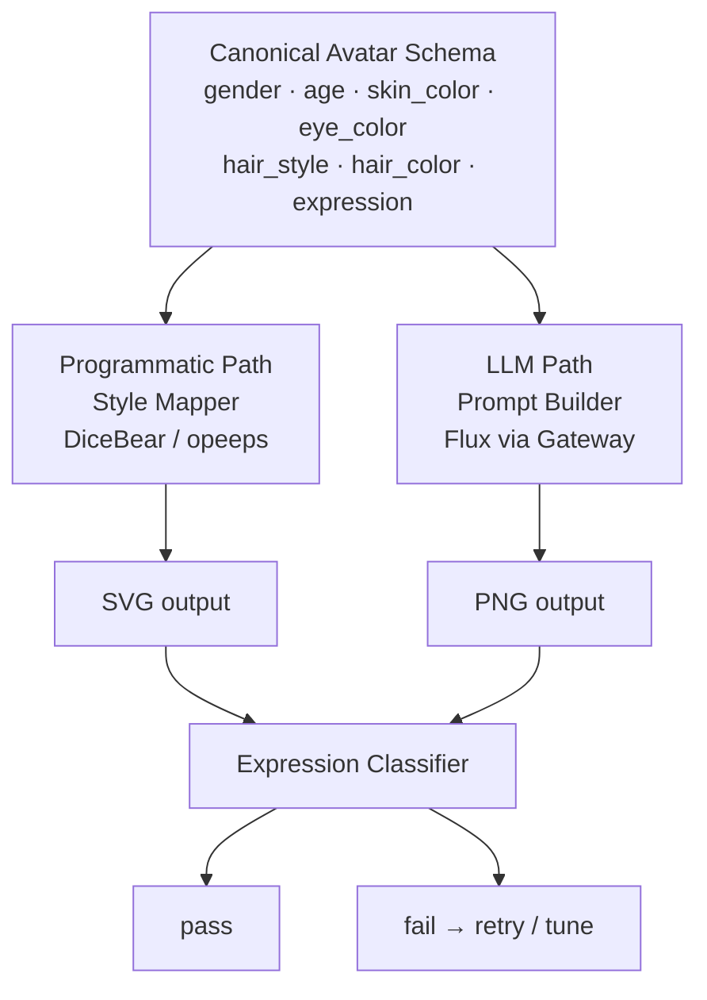

# Programmatic Avatar (PA) — System Plan

## Goal

Build a systematic persona + expression system where both programmatic (DiceBear / opeeps)
and LLM-generated avatars share a canonical property schema and implement expressions in a
way any LLM or human can reliably identify.

## Architecture

## Property Requirements

### Must-have (this phase — no forking)

| Property | toon-head | avataaars | bottts | micah | opeeps |
|---|---|---|---|---|---|
| Natural-looking eyes (almond) | ⚠️ cartoon | ⚠️ cartoon | ❌ robot frames | ✅ almond variants | ✅ ellipse/round |
| Skin color | ✅ hex | ✅ hex | ⚠️ body color only | ✅ hex | ✅ hex |
| Mouth expression | ✅ 5 variants | ✅ 12 variants | ✅ 9 variants | ✅ 8 variants | ✅ 8 variants |
| Pupil visible | ⚠️ style-dependent | ⚠️ style-dependent | ❌ robot optics | ✅ round/smiling | ✅ round |
| Eyebrows | ✅ 5 variants | ✅ 13 variants | ❌ none | ✅ 4 variants | ✅ 4 variants |
| Hair / top color | ✅ hex | ✅ hex | ❌ no top color | ✅ hex | ✅ hex |
| Hair / top style | ⚠️ 4 front styles | ✅ 34 styles | ✅ 9 robot tops | ✅ 8 styles | ✅ 8 styles |
| Attire variety (t-shirt, suit, hoodie, dress) | ⚠️ shirt/dress/tShirt, no suit/hoodie | ✅ blazer, hoodie, shirts | ❌ no clothing | ⚠️ 3 shirt types only | ⚠️ 3 shirt types only |

Legend: ✅ meets requirement · ⚠️ partial / limited · ❌ missing

### Out of scope this phase

- **Face shapes** — deferred to fork phase
- **Accessories** (glasses, earrings, necklace) — deferred to fork phase
- **Eye color** — only micah supports it; not pursued across styles
- **Eye shadow** — micah-only cosmetic detail
- **Nose shape variation** — too style-specific to normalise
- **Clothing graphics / prints** — avataaars has graphic tees; treat as bonus
- **Beard / facial hair** — supported where available; not required
- **Hat color** — avataaars only; bonus

### Gap summary

| Style | Remaining blockers | Verdict |
|---|---|---|
| **toon-head** | Cartoon eyes, 4 hair styles only | ⚠️ usable — expression works via brow+mouth |
| **avataaars** | Cartoon eyes | ✅ strong coverage |
| **bottts** | No eyebrows, robot eyes, no clothing, no hair color | ✅ accepted as-is — intentionally limited, like Abbreviation |
| **micah** | Limited clothing (3 shirt types, no hoodie/dress) | ✅ strong coverage |
| **opeeps** | Limited clothing (3 shirt types, no hoodie/dress) | ✅ strong coverage |

## Open Decisions

### 1. Fork the JS style libraries?

The style-specific enum options (e.g. toon-head only has 5 eye shapes, none named
"angry-raised-brow") are the main constraint on expression fidelity in the programmatic path.
Forking one or more DiceBear style packages would allow:

- Adding expression-optimised variants (e.g. a dedicated "brow furrow" for anger in toon-head)
- Exposing new properties currently absent from a style (e.g. eye-color in toon-head)
- Aligning enum names to our canonical vocabulary

Cost: maintenance burden on fork(s). The styles are MIT / CC BY 4.0 so forking is clean.
The vendor layout already supports pointing `package.json` at a GitHub fork URL.

### 2. Canonical schema scope

Which properties are universal across both paths? First-cut proposal:

| Property | Type | Notes |
|---|---|---|
| gender | enum: male, female, non-binary | drives name + LLM prompt phrasing |
| age | integer 25–70 | drives LLM prompt; no direct PA mapping yet |
| skin_color | hex | PA: mapped per style; LLM: in prompt |
| eye_color | hex | PA: micah only today; LLM: in prompt |
| hair_style | semantic enum | PA: mapped per style; LLM: in prompt |
| hair_color | hex | PA: most styles; LLM: in prompt |
| expression | enum: 6 canonical | PA: eye/mouth/brow variant; LLM: FACS prompt |
| bg_color | hex | PA: backgroundColor; LLM: background directive |

The stack (what DiceBear styles support) determines which properties are achievable
programmatically today vs. only via LLM — and therefore also shapes the product scope.

### 3. Expression validation for the PA path

LLM-generated avatars are validated by the expression tuner / classifier. Programmatic
avatars currently are not. The same classifier could run against PA SVGs (rasterised)
to score each style × expression combination and flag weak mappings before shipping.

---

## Research Done

### Expression Mapping

Current best-effort mapping of canonical expressions to style-specific variants.
These are unvalidated — no classifier has been run against PA output yet.

#### toon-head

| Expression | eyes   | mouth | eyebrows |
|------------|--------|-------|----------|
| neutral    | humble | smile | neutral  |
| happiness  | happy  | laugh | happy    |
| surprise   | wide   | agape | raised   |
| anger      | bow    | angry | angry    |
| sadness    | humble | sad   | sad      |
| contempt   | wink   | smile | neutral  |

#### avataaars

| Expression | eyes      | mouth       | eyebrows             |
|------------|-----------|-------------|----------------------|
| neutral    | default   | default     | default              |
| happiness  | happy     | smile       | raisedExcited        |
| surprise   | surprised | screamOpen  | raisedExcitedNatural |
| anger      | squint    | grimace     | angryNatural         |
| sadness    | cry       | sad         | sadConcernedNatural  |
| contempt   | side      | serious     | upDown               |

#### bottts

| Expression | eyes    | mouth   |
|------------|---------|---------|
| neutral    | sensor  | smile01 |
| happiness  | happy   | smile02 |
| surprise   | bulging | bite    |
| anger      | robocop | grill01 |
| sadness    | shade01 | diagram |
| contempt   | eva     | grill02 |

#### micah

| Expression | eyes          | mouth     | eyebrows      |
|------------|---------------|-----------|---------------|
| neutral    | eyes          | smile     | up            |
| happiness  | smiling       | laughing  | eyelashesUp   |
| surprise   | round         | surprised | up            |
| anger      | eyesShadow    | frown     | down          |
| sadness    | eyesShadow    | sad       | eyelashesDown |
| contempt   | smilingShadow | smirk     | eyelashesDown |

#### opeeps (avatar-illustration-system)

| Expression | eye           | mouth     | eyebrow      |
|------------|---------------|-----------|--------------|
| neutral    | Round         | Smile     | Up           |
| happiness  | Smiling       | Laughing  | EyelashesUp  |
| surprise   | Round         | Surprised | Up           |
| anger      | Ellipse       | Frown     | Down         |
| sadness    | EllipseShadow | Sad       | Down         |
| contempt   | Round         | Smirk     | EyelashesUp  |

---

### Feature Matrix

What each style supports, by semantic property category.

#### Face & Skin

| Property | toon-head | avataaars | bottts | micah | opeeps |
|---|---|---|---|---|---|
| skin-color | hex | hex | hex (`baseColor`) | hex (`baseColor`) | hex (`color.skinColor`) |
| face / head shape | — | — | enum(6): round01/02, square01–04 | — | — |
| ear style | — | — | — | enum(2): attached, detached | enum(2): Attached, Detached |
| nose shape | — | enum(1): default | — | enum(3): curve, pointed, tound | enum(3): Round, Pointed, Curved |
| outline color | — | — | — | — | hex (`color.outlineColor`) |
| background color | hex | hex | — | — | hex (`circle.backgroundColor`) |

#### Eyes

| Property | toon-head | avataaars | bottts | micah | opeeps |
|---|---|---|---|---|---|
| eye shape / expression | enum(5): happy, wide, bow, humble, wink | enum(12): closed, cry, default, eyeRoll, happy, hearts, side, squint, surprised, winkWacky, wink, xDizzy | enum(14): bulging, dizzy, eva, frame1/2, glow, happy, hearts, robocop, round, roundFrame01/02, sensor, shade01 | enum(5): eyes, round, eyesShadow, smiling, smilingShadow | enum(4): Round, Smiling, Ellipse, EllipseShadow |
| eye color | — | — | — | hex | — |
| eye shadow color | — | — | — | hex (`eyeShadowColor`) | — |

#### Eyebrows

| Property | toon-head | avataaars | bottts | micah | opeeps |
|---|---|---|---|---|---|
| eyebrow shape / expression | enum(5): raised, angry, happy, sad, neutral | enum(13): angryNatural, defaultNatural, flatNatural, frownNatural, raisedExcitedNatural, sadConcernedNatural, unibrowNatural, upDownNatural, angry, default, raisedExcited, sadConcerned, upDown | — | enum(4): up, down, eyelashesUp, eyelashesDown | enum(4): Up, Down, EyelashesUp, EyelashesDown |
| eyebrow color | — | — | — | hex | — |

#### Mouth

| Property | toon-head | avataaars | bottts | micah | opeeps |
|---|---|---|---|---|---|
| mouth shape / expression | enum(5): laugh, angry, agape, smile, sad | enum(12): concerned, default, disbelief, eating, grimace, sad, screamOpen, serious, smile, tongue, twinkle, vomit | enum(9): bite, diagram, grill01/02/03, smile01/02, square01/02 | enum(8): surprised, laughing, nervous, smile, sad, pucker, frown, smirk | enum(8): Laughing, Frown, Nervous, Pucker, Sad, Smile, Smirk, Surprised |
| mouth color | — | — | — | hex | — |

#### Hair

| Property | toon-head | avataaars | bottts | micah | opeeps |
|---|---|---|---|---|---|
| hair style (front) | enum(4): sideComed, undercut, spiky, bun | enum(34): hat, hijab, turban, winterHat×4, bob, bun, curly, curvy, dreads, frida, fro, froBand, longButNotTooLong, miaWallace, shavedSides, straight01/02, straightAndStrand, dreads01/02, frizzle, shaggy, shaggyMullet, shortCurly, shortFlat, shortRound, shortWaved, sides, theCaesar, theCaesarAndSidePart, bigHair | enum(9): antenna, antennaCrooked, bulb01, glowingBulb01/02, horns, lights, pyramid, radar | enum(8): fonze, mrT, dougFunny, mrClean, dannyPhantom, full, turban, pixie | enum(8): Fonze, MisterT, Full, Bald, Doug, Phantom, Turban, Pixie |
| rear hair | enum(4): longStraight, longWavy, shoulderHigh, neckHigh | — | — | — | — |
| hair color | hex | hex | — | hex | hex (`color.topColor`) |
| hat color | — | hex | — | — | — |

#### Facial Hair

| Property | toon-head | avataaars | bottts | micah | opeeps |
|---|---|---|---|---|---|
| beard / facial hair style | enum(5): moustacheTwirl, fullBeard, chin, chinMoustache, longBeard | enum(5): beardLight, beardMajestic, beardMedium, moustacheFancy, moustacheMagnum | — | enum(2): beard, scruff | — |
| beard / facial hair color | — | hex | — | hex | — |

#### Clothing

| Property | toon-head | avataaars | bottts | micah | opeeps |
|---|---|---|---|---|---|
| clothing style | enum(5): turtleNeck, openJacket, dress, shirt, tShirt | enum(9): blazerAndShirt, blazerAndSweater, collarAndSweater, graphicShirt, hoodie, overall, shirtCrewNeck, shirtScoopNeck, shirtVNeck | — | enum(3): open, crew, collared | enum(3): Collared, Crew, Tee |
| clothing color | hex | hex | — | hex (`shirtColor`) | hex (`color.shirtColor`) |
| clothing graphic | — | enum(10): bat, bear, cumbia, deer, diamond, hola, pizza, resist, skull, skullOutline | — | — | — |
| collar color | — | — | — | — | hex (`color.collarColor`) |

#### Accessories

| Property | toon-head | avataaars | bottts | micah | opeeps |
|---|---|---|---|---|---|
| glasses style | — | enum(7): kurt, prescription01/02, round, sunglasses, wayfarers, eyepatch | — | enum(2): round, square | enum(2): Round, Square |
| glasses color | — | hex (`accessoriesColor`) | — | hex (`glassesColor`) | hex (`color.glassFrameColor`) |
| earrings style | — | — | — | enum(2): hoop, stud | — |
| earring color | — | — | — | hex | — |
| misc accessories | — | — | enum(7): antenna01/02, cables01/02, round, square, squareAssymetric (sides/arms) | — | — |
| misc accessories color | — | hex | — | — | — |

#### Robot-specific (bottts only)

| Property | values |
|---|---|
| body / base color | hex (`baseColor`) |
| texture overlay | enum(8): camo01/02, circuits, dirty01/02, dots, grunge01/02 |
| sides / arms | enum(7): antenna01/02, cables01/02, round, square, squareAssymetric |
| top attachment | enum(9): antenna, antennaCrooked, bulb01, glowingBulb01/02, horns, lights, pyramid, radar |

#### Probability controls

All styles with optional components expose a `*Probability` integer (0–100). E.g.
`hairProbability`, `beardProbability`, `accessoriesProbability`, `glassesProbability`,
`earringsProbability`.
