# Avatar Studio — Avatars Design

## Table of Contents

1. [Avatars Essence](#1-avatars-essence)
2. [Style](#2-style)
   - [2.1 Baseline Characteristics](#21-baseline-characteristics)
   - [2.2 Styles](#22-styles)
   - [2.3 Style Comparison Matrix](#23-style-comparison-matrix)
3. [Avatar Personality](#3-avatar-personality)
   - [3.1 Shared Personality Traits](#31-shared-personality-traits)
   - [3.2 Other Personality Traits](#32-other-personality-traits)
4. [Expressions](#4-expressions)
5. [LLM Avatar Creation Prompt Pipeline](#5-llm-avatar-creation-prompt-pipeline)
   - [A — Randomize Person](#a--randomize-person)
   - [B — Generate CV](#b--generate-cv)
   - [C — Presentation](#c--presentation)
   - [D — Abbreviation + ToonHead Avatars](#d--abbreviation--toonhead-avatars)
   - [E — Canonical Portrait](#e--canonical-portrait)
   - [F — Expression Avatars](#f--expression-avatars)

---

## 1. Avatars Essence

Avatar Studio generates avatars for any type of persona — from professional advisors to cartoon characters to babies.
The visual identity, personality, and style are fully configurable via the style and persona inputs; no particular character archetype is assumed.
Every avatar shall present the background, skills and traits of the persona as defined by the caller
 - **Important:** there shall be no assumption about age, race, gender or otherwise
  legally-protected traits when creating those avatars, including when considering
  their background, skills and traits.

---

## 2. Style

The avatar pipeline supports **multiple visual styles**. The user selects a style when generating an avatar; the chosen style's `system_prompt` is injected verbatim into the image model call. Background and framing are added programmatically and are not part of the style definition.

Styles are the single source of truth in [`assets/styles/styles.yml`](../../assets/styles/styles.yml).

### 2.1 Baseline Characteristics

The following apply to **all styles** regardless of visual rendering:

**Composition**
- Bust-up portrait — head, shoulders, upper chest
- Front-facing or slight ¾ turn (≤15°)
- Centered, balanced composition

**Attire and Vibe**
Determined by the style and persona. No universal attire or vibe is imposed — a baby style and a photorealistic corporate portrait have nothing in common here.

**Background**
Added programmatically by Step G (not in the style `system_prompt`).

---

### 2.2 Styles

Detailed descriptions for five styles are below. The full set (plus `random`) is defined in `assets/styles/styles.yml` — new styles added there become active automatically.

#### 3D Animation (`studio_3d`)
> *High-quality 3D animated feature film characters*

Fully 3D rendered with physically-based lighting, multi-point specular highlights, fine strand-level hair detail, and exaggerated cartoon expressions.

- Dramatic CG lighting — blue/cool-toned rim or back light on hair and shoulders
- Large rounded eyes with bright multi-point specular catchlights — clearly larger than realistic
- Volumetric hair in distinct curved clusters with AO and strand-level sheen
- Smooth glossy skin — soft specular on forehead and cheekbones
- Exaggerated 1.5:1 head-to-body ratio
- Rich tonal range: skin 5+ tones (base → shadow → AO crease → highlight → specular); hair 4+ tones
- Exaggerated expression — emotion amplified, reads from across the room

---

#### Korean Cartoon (`korean`)
> *2D digital illustration / light anime character design*

2D digital Korean-style illustration with anime influence, no silhouette outline, semi-realistic proportions, and full highlight-plus-shadow rendering.

- No outline on the silhouette — shapes defined by adjacent flat color areas
- Semi-realistic proportions — slim elongated face, almond-shaped eyes moderately large
- Fine details — individual eyelashes, layered overlapping hair strand shapes
- 3–4 tones per area: skin (base + shadow + 1–2 highlights); hair (base + tones + specular strip); eyes (base + 2 highlight dots)
- Pale or light-toned skin — faint delicate complexion
- Shiny glossy hair with specular strip; shiny wet-look eyes with bright catchlights
- Exaggerated expression — wide eyes, raised brows, open smile

---

#### Photo-Realistic (`photorealistic`)
> *Portrait photography / photorealistic rendering*

Full photographic realism — natural skin texture, accurate lighting with subsurface scattering, anatomically correct proportions, shallow depth of field.

- Natural skin texture with visible pores and subtle imperfections
- Physically accurate lighting — single-point catchlights, subsurface scattering
- Anatomically correct facial proportions
- Shallow depth of field — sharp focus on eyes, soft bokeh on background

---

#### Line Art Sticker (`lineart`)
> *Sticker pack illustration / web avatar icon*

Simple 2D web-illustration with outline strokes, simplified friendly proportions, flat fills with no highlights, and large-scale features only.

- Outline strokes present on silhouette and all facial features
- Large-scale features only — no eyelashes, no hair strands, no skin texture
- Max 3 flat tones per area (hair / clothing item / skin) — no highlights anywhere
- Simplified round friendly face proportions — not semi-realistic
- Rich multi-color palette (8+ distinct hues)
- Natural expression — face near resting state

---

#### 3D Clay (`clay`)
> *Commercial 3D plastic-clay character pack*

Smooth 3D render with a matte clay/plastic finish, simplified large-scale features, no fine detail, warm diffuse lighting, and understated expressions.

- Prominent warm pink/rosy blush circles on both cheeks
- Matte surface — zero specular highlights anywhere
- 2–3 flat tones per area (base + at most 1 soft shadow) — no highlights
- Warm flat diffuse lighting — no rim light, no dramatic shadows
- Hair as a simple smooth rounded solid mass — single tone, no strand detail
- Realistic head-to-body proportions
- Large-scale features only — no eyelashes, no skin pores
- Understated expression — face near rest, emotion soft and minimal

---

### 2.3 Style Comparison Matrix

These styles form two stylistic pairs plus one photorealistic anchor.
The pairs share the same differentiating axes — finish, tonal range, detail level, and expression intensity:

| | **lineart** | **korean** | **clay** | **studio_3d** | **photorealistic** |
|---|---|---|---|---|---|
| **finish** | flat / matte | shiny (hair + eyes) | matte, zero specular | glossy PBR specular | photographic |
| **tones per area** | max 3, 0 highlights | 3–4 (base + shadow + 1–2 highlights) | 2–3 (base + 1 shadow, 0 highlights) | 5+ (base + multi-shadow + AO + specular) | continuous / photographic |
| **detail level** | large-scale shapes only | fine (eyelashes, hair strands) | large-scale shapes only | fine (strands, AO, iris detail) | full photographic detail |
| **expression** | natural / resting | exaggerated | understated / subtle | exaggerated | natural |
| **proportions** | simplified, round friendly | semi-realistic, slim face | realistic | exaggerated 1.5:1 head ratio | anatomically correct |
| **outline** | present on silhouette | none (color separation only) | none (3D volume) | none (3D volume) | none (photography) |

> **Key confusion pairs and their distinguishing signal:**
> - `lineart` vs `korean` — lineart has silhouette outlines + no highlights + natural expression; korean has no outline + shiny hair/eyes + exaggerated expression
> - `clay` vs `studio_3d` — clay is matte + simple + understated; studio_3d is glossy + fine detail + exaggerated expression

---

## 3. Avatar Personality

## 3.1. Shared Personality Traits

One trait applies universally to all avatars:

| Trait | Expression |
|---|---|
| **Neutral** | Absolute adherence to diversity; no stereotypical mapping of traits to identity |

## 3.2 Other Personality Traits

User may define traits in the advisor YAML (`traits` field).
These user-specific traits **should NOT** effect the avatar generation.
Exceptions:
1. The trait is explicitly a visible one, such as an accessory-using
2. The trait override a known demographic

Examples:
| Trait | Expression |
|---|---|
| **Decisive** | N/A|
| **Analitical** | N/A |
| **Joyful** | N/A |
| **Wearing glasses** | Add Glasses excessory |
| **Male** | effects: gender |
| **Young** | effects: age |

---

## 4. Expressions

Avatars express a range of emotional states — rendered within the register defined by the persona and style. Every expression carries a subtle baseline warmth (a faint cheek lift and soft lip set) that prevents the face from reading as cold or blank, even in neutral or negative states.

All expression definitions — IDs, categories, summaries, agent trigger rules, avatar rendering instructions, and FACS Action Unit references — are in [expressions.yml](expressions.yml) (single source of truth).

---

## 5. LLM Avatar Creation Prompt Pipeline

Avatar generation follows a **portrait-first** pipeline: a canonical neutral
portrait is generated once, then each expression variant is derived from that
portrait so every image depicts the same person.

### Pipeline Flowchart

```mermaid
flowchart TD
    subgraph user ["<b>User</b>"]
        style user fill:#F3E8FF,color:#333,stroke:#A855F7
        BOTTON_GENERATE((Generate)):::pink
        USER_ROLE[/<b>Role Description</b>/]:::io
        USER_STYLE[/<b>Style</b>/]:::io
        USER_REVIEW{USER_REVIEW}:::io
    end

    subgraph Stage1["Stage 1: build persona parameters"]
        style Stage1 fill:#ECECEC,color:#333,stroke:#AAAAAA
        StepA
        DEMO["<B>Personal</B><i><br/>NAME, GENDER, AGE </i>"]:::data
        PHENO["<B>Phenotype</B><i><br/>SKIN_TONE, NOSE_SHAPE <br/>HAIR_TYPE, HAIR_COLOR <br/> EYE_SHAPE, EYE_COLOR <br/>BROWS_STYLE, BROWS_COLOR <br/> CHIN_SHAPE, CHEEKS_SHAPE</i>"]:::data
        STYLE["<B>Style</B><i><br/>STYLE, BG_COLOR</i>"]:::data
        StepB
        CV["<B>CV</B><br/> EDUCATION <br/> EXPERIENCE <br/> TRAITS"]:::data
        StepC
        PRESENT["<B>PRESENTATION</B><br/> HAIR_STYLE <br/> CLOTHING <br/> ACCESSORIES"]:::data
        PERSONA[("<b>avatar_persona.yml</b>")]:::data
        DEMO --o PERSONA
        PHENO --o PERSONA
        CV --o PERSONA
        PRESENT --o PERSONA
        STYLE --o PERSONA
    end

    subgraph Stage2["Stage 2: build avatars"]
        style Stage2 fill:#ECECEC,color:#333,stroke:#AAAAAA
        StepD
        ABBR[("FINAL FILE:<BR/><B>avatar_abbr.png</B>")]:::final_file
        StepE
        PORTRAIT["<B>avatar neutral raw</B>"]:::data
        StepF
        AVATARS["<B>avatar expressions raw</B>"]:::data
        StepG
        FINALS[("FINAL FILES:<BR/><B>avatar_expressions.png</B>")]:::final_file
    end


    %%%%%%%%%%%%%%%%%%%%%%%%%%%%%%%%%%%%%%%%%%%%%%%%%%%%%%%%%%%%%%%%%%%%%%%%%%%%
    StepA(["---<br/><b>A — Randomize Person</b><br/><i>Code: Uniform random pick</i><br/>---"]):::code

    %% step A triggers
    BOTTON_GENERATE --> StepA
    USER_STYLE .-> |read| StepA

    %% step A outputs
    StepA .->|write| PHENO
    StepA .->|write| DEMO
    StepA .->|write| STYLE

    %%%%%%%%%%%%%%%%%%%%%%%%%%%%%%%%%%%%%%%%%%%%%%%%%%%%%%%%%%%%%%%%%%%%%%%%%%%%
    StepB(["---<br/><b>B — Gen. CV</b><br/><i>LLM: Text model</i><br/>---"]):::llm_text

    %% step B inputs
    USER_ROLE .->|read| StepB
    DEMO .->|read:AGE| StepB

    %% step B outputs
    StepB .->|write| CV

    %%%%%%%%%%%%%%%%%%%%%%%%%%%%%%%%%%%%%%%%%%%%%%%%%%%%%%%%%%%%%%%%%%%%%%%%%%%%
    StepC(["---<br/><b>C — Presentation</b><br/><i>LLM: Text model</i><br/>---"]):::llm_text

    %% step C inputs
    CV .->|read| StepC
    PHENO .->|read| StepC
    DEMO .->|read| StepC

    %% step C outputs
    StepC .->|write| PRESENT

    %%%%%%%%%%%%%%%%%%%%%%%%%%%%%%%%%%%%%%%%%%%%%%%%%%%%%%%%%%%%%%%%%%%%%%%%%%%%
    StepD(["---<br/><b>D — Abbr. Avatar</b><br/><i>Code: Pillow</i><br/>---"]):::code

    %% step D inputs
    DEMO .->|read:NAME| StepD
    STYLE .->|read:BG_COLOR| StepD

    %% step D outputs
    StepD .->|write| ABBR

    %%%%%%%%%%%%%%%%%%%%%%%%%%%%%%%%%%%%%%%%%%%%%%%%%%%%%%%%%%%%%%%%%%%%%%%%%%%%
    subgraph StepE ["<b>E — Canonical Portrait</b>"]
        style StepE fill:#E67E22,color:#fff,stroke:#C46A1A
        STYLES[("<b>styles.yml</b><br/><i>style params - const</i>")]:::const_file
        STYLES .-> StepE_LLM(["---<br/><i>LLM: Image model</i><br/>---"]):::llm_image
    end

    %% step E inputs
    PERSONA .->|read| StepE

    %% step E output
    StepE .->|write| PORTRAIT --> USER_REVIEW

    %%%%%%%%%%%%%%%%%%%%%%%%%%%%%%%%%%%%%%%%%%%%%%%%%%%%%%%%%%%%%%%%%%%%%%%%%%%%
    subgraph StepF ["<b>F — Expression Avatars</b>"]
        style StepF fill:#E67E22,color:#fff,stroke:#C46A1A
        EXPRESSIONS[("<b>expressions.yml</b><br/><i>expression params - const</i>")]:::const_file
        EXPRESSIONS .-> StepF_LLM(["---<br/><i>LLM: Image model</i><br/>---"]):::llm_image
    end

    %% step F triggers
    USER_REVIEW -->|Continue| StepF
    USER_REVIEW -->|Reroll| REROLL((return to A)):::pink

    %% step F inputs
    PERSONA .->|read| StepF
    PORTRAIT .->|read| StepF

    %% step F outputs
    StepF .->|write| AVATARS

    %%%%%%%%%%%%%%%%%%%%%%%%%%%%%%%%%%%%%%%%%%%%%%%%%%%%%%%%%%%%%%%%%%%%%%%%%%%%
    StepG(["---<br/><b>G — Sticker on Background</b><br/><i>Code: Pillow</i><br/>---"]):::code

    %% step F inputs
    AVATARS .-> |read| StepG

    %% step F outputs
    StepG .-> |write| FINALS


    %%%%%%%%%%%%%%%%%%%%%%%%%%%%%%%%%%%%%%%%%%%%%%%%%%%%%%%%%%%%%%%%%%%%%%%%%%%%
    %% Class definitions
    classDef code       fill:#4A90D9,color:#fff,stroke:#3A70B0
    classDef llm_text   fill:#27AE60,color:#fff,stroke:#1E8C4E
    classDef llm_image  fill:#E67E22,color:#fff,stroke:#F5C193,stroke-width:3px
    classDef data       fill:#FFF5B0,color:#333,stroke:#4E4300
    classDef const_file fill:#FFF,color:#333,stroke:#111
    classDef final_file fill:#EF1D1D,color:#FFF,stroke:#480202,font-weight:bold
    classDef io         fill:#9B59B6,color:#fff,stroke:#7D3C98,font-weight:bold
    classDef pink       fill:#FF69B4,color:#fff,stroke:#CC1477,font-weight:bold
```

---

### A — Randomize Person

> **Design intent:** demographic and phenotype traits are selected **uniformly at random**
> from equal-weight lists. No group is favored or disfavored. The categories
> exist solely as visual descriptors to guide the image model — they are not
> identity labels and do not represent real-world population ratios. The goal
> is visual variety across a set of generated personas, not demographic modelling.

Personal fields are randomized at generation time (not seeded from the advisor
name). When re-generating an advisor, fresh random values are chosen.

**DEMO** fields:
- **NAME** — generated full name
- **GENDER** — uniform random pick from: male, female, non-binary
- **AGE** — uniform random integer 25–70

**PHENO** fields (all randomized in this step):
- **Color picks** — **SKIN_TONE**, **HAIR_COLOR**, **EYE_COLOR**, **BROWS_COLOR** — uniform random picks
- **Shape picks** — **EYE_SHAPE**, **BROWS_STYLE**, **NOSE_SHAPE**, **CHIN_SHAPE**, **CHEEKS_SHAPE** — uniform random picks
- **BG_COLOR** — uniform random pick from PALETTE (same palette used for abbreviation avatars)

This step is pure randomization in code — no LLM call is made.

---

### B — Generate CV

> **Design intent:** given the role/persona description and the avatar's age from §A,
> an LLM call generates a character profile. This enables the
> **multi-candidate** flow where the system produces diverse candidates from
> a single persona input, with each candidate receiving a distinct background.

An LLM call generates a YAML profile with three keys:

- **education** — 1–2 items (degrees, certifications)
- **experience** — 1–2 items (years and domain)
- **traits** — 2–3 personality traits

#### Model call parameters:
- **Temperature**: 0.7 (encourages diversity across candidates)
- **Max tokens**: 512
- **Max retries**: 10
- **Inputs**: USER_ROLE, DEMO:AGE

---

### C — Presentation

> **Design intent:** given the advisor's CV, phenotype, and demographics, an LLM
> call selects the presentation details that complete the visual persona.
> Temperature *0.5* balances consistency with natural variation — coherent choices
> that still differ meaningfully across candidates.

#### Model call parameters:
- **Temperature**: 0.5
- **Max tokens**: 1024
- **Max retries**: 10
- **Inputs**: CV (§B), PHENO (§A), DEMO (§A)

**PRESENT** output fields:
- **HAIR_STYLE** — e.g. short wavy, bun, cropped
- **CLOTHING** — attire selection appropriate to the persona and style
- **ACCESSORIES** — optional discreet items (glasses, earring, timepiece)

Prompts and output schema are defined in `avatar_studio_settings.json`.

> After §C completes, DEMO + PHENO + CV + PRESENT are marshaled into a single
> `avatar_persona` dict — the **single source of truth** for image prompts and
> the UI panel display.

---

### D — Abbreviation + ToonHead Avatars

> **Design intent:** two lightweight code-generated avatars are produced in
> parallel so the UI always has something to display while the image model runs.

#### D.1 — Abbreviation

Generated by **Pillow** (no LLM call):

- **Inputs**: DEMO:NAME (for initials), PHENO:BG_COLOR (background), `#FFFFFF` foreground
- **Output**: `<slug>-abbreviation.png` — square raster, initials centered on solid background circle

#### D.2 — Programmatic Avatar (PA)

Generated by **DiceBear** (multi-style, CC BY 4.0) via a vendored Node.js
sub-project (`vendor/programmatic-avatar/`). No LLM call; deterministic from the person's name.

- **Inputs**: DEMO:NAME (seed), PHENO:BG_COLOR (background color option)
- **Output**: `<slug>-toon-head.svg` — scalable cartoon head SVG
- **Failure behavior**: non-fatal — the pipeline continues without it if Node.js is unavailable

---

### E — Canonical Portrait

This is the **identity prompt** — it fully defines what the person looks like.
It is called once and produces the neutral portrait that all expression variants
will reference.

Image models use a single combined `prompt.txt` (no separate system/user prompt files).

*where*:
{avatar_persona.yml} - replace by a (properly indented) dump of `avatar_persona.yml`
{expressions.yml:{expression}} - replace by a (properly indented) dump of `expressions.yml:neutral`

---

### F — Expression Avatars

This prompt is sent **together with the neutral portrait image** (base64 in
Ollama's `images` field). It asks the model to re-render the same person with a
different expression.

Image models use a single combined `prompt.txt` (no separate system/user prompt files).

*where*:
{avatar_persona.yml} - replace by a (properly indented) dump of `avatar_persona.yml`
{expressions.yml:{expression}} - replace by a (properly indented) dump of `expressions.yml:{expression}`

---

### G — Apply Avatar on Background

> **Design intent:** Highlight the portrait, while providing color-background for fast-recognising.
> **Design style**

> Remove any background generated in the previous LLM-image generation
> Portrait covers ~ 90% of the picture vertical (~425px), highlighted by a 6-pixel width white "sticker" margins
> `BG_COLOR` circle in the back with radius of 33% of the image (~350x350px)

Generated by **Pillow** (no LLM call):

- **Inputs**: temporary files of avatars + expressions
- **Output**: `avatar_expression.png` files
