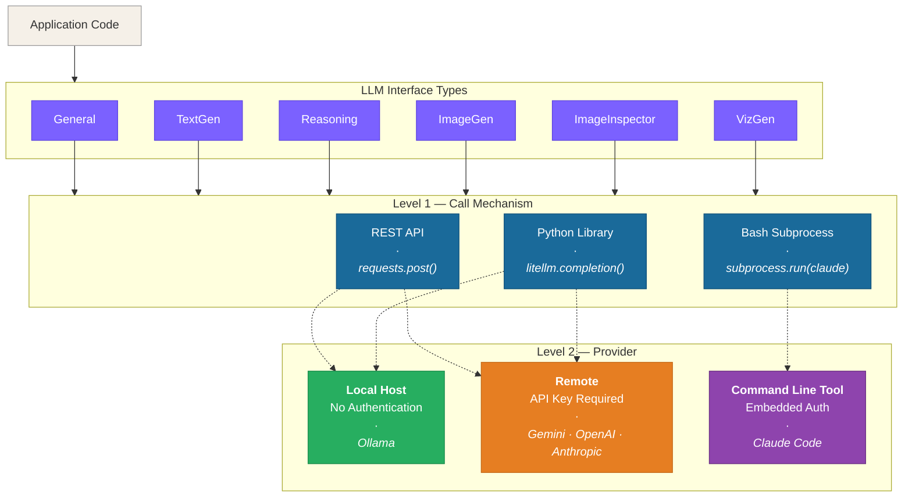

# LLM Gateway — Abstraction Design

**Project**: avatar-studio — standalone avatar generation package
**Date**: 2026-03-26
**Version**: 0.1.0

---

## Table of Contents

1. [Overview](#1-overview)
2. [The 6 Interface Types](#2-the-6-interface-types)
3. [The Two Levels of Abstraction](#3-the-two-levels-of-abstraction)
4. [Interface Type Contracts](#4-interface-type-contracts)
5. [Built-in Validation and Retry](#5-built-in-validation-and-retry)
6. [Capability Matrix](#6-capability-matrix)
7. [Implementation Details](#7-implementation-details)
8. [Architecture Call-Flow Diagram](#8-architecture-call-flow-diagram)
9. [Configuration and Selection](#9-configuration-and-selection)
10. [Related Documents](#10-related-documents)

---

## 1. Overview

Avatar studio uses LLMs for 6 distinct task categories. Each category has its own input/output contract, preferred model characteristics, and tuning knobs.

Three execution mechanisms exist for reaching those models:
**Local** (Ollama REST API), **API-Key** (LiteLLM Python library), and **CLI** (Claude Code
subprocess).

This document defines the **two-level abstraction** that isolates application code from both
the **call mechanism (Level 1)** and the **provider specifics (Level 2)**.

The 6 types overlap at the transport layer — General, Text-gen, Reasoning, and Viz-gen all
send messages and receive text — but keeping them as separate named types allows independent
model selection, temperature tuning, token budgets, retry strategies, and validation logic
per use-case.

---

## 2. The 6 Interface Types

| # | Type | Task character |
|---|------|---------------|
| 1 | **General** | Open-ended text I/O — chat, summarisation, free-form responses |
| 2 | **Text-gen** | Structured text generation — output must match a schema (YAML, JSON, or template) |
| 3 | **Reasoning** | Multi-step analytical thinking — chains of logic, comparison, decision-making |
| 4 | **Image-gen** | Prompt → PNG — diffusion/generative image models |
| 5 | **Image Inspector** | PNG → text — vision models that analyse, classify, or describe an image |
| 6 | **Viz-gen** | Context + goal → structured JSON spec consumed by a fixed plotting call |

Each type defines a fixed **contract** — the shapes of inputs and outputs that callers depend
on. Implementations must satisfy the contract; callers never touch implementation internals.

### Why keep overlapping types separate?

Types 1, 2, 3, and 6 share the same transport contract (`messages → text`) but differ in:

| Dimension | General | Text-gen | Reasoning | Viz-gen |
|-----------|---------|----------|-----------|---------|
| Ideal model class | Balanced, conversational | Instruction-following, structured | Thinking/reasoning models | Instruction-following, structured |
| Typical temperature | 0.7 | 0.3 | 0.1 | 0.2 |
| Max tokens | Medium (2048) | Short (512) | Long (4096+) | Short (512) |
| Built-in retry / validation | No | Yes — schema-validate | No | Yes — schema-validate |
| Real-time streaming (SSE) | ✅ May support | ❌ Must wait for full response to validate | ✅ May support | ❌ Must wait for full response to validate |
| System prompt style | Open | Strict output format | Chain-of-thought | Strict JSON/dict output format |

---

## 3. The Two Levels of Abstraction



### Level 1 — Call Mechanism

| Mechanism | Description | Reaches |
|-----------|-------------|---------|
| **REST API** | `requests.post()` to an HTTP endpoint | Local or remote providers |
| **Python library** | `litellm.completion()` in-process (may use REST internally) | Local or remote providers |
| **Bash subprocess** | `subprocess.run(["claude", ...])` | CLI-managed provider only |

### Level 2 — Provider

| Provider type | Examples | API key | Notes |
|--------------|---------|:-------:|-------|
| **Local** | Ollama | ❌ | Reachable via REST or Python library with `api_base` |
| **Remote** | Gemini, OpenAI, Anthropic API | ✅ | Reachable via Python library; key set as env var |
| **CLI-managed** | Claude Code (Anthropic) | ❌ in code | Auth embedded in the CLI tool (`~/.claude/`) |

---


## 4. Interface Type Contracts

### Request role conventions

Not all interface types or provider implementations support the full `system / user / assistant`
message convention. The table below documents what each type expects and what providers
honour:

| Type | `system` role | `user` role | `assistant` role |
|------|:------------:|:-----------:|:----------------:|
| **General** | ✅ | ✅ | ✅ |
| **Text-gen** | ✅ | ✅ | ✅ |
| **Reasoning** | ✅ | ✅ | ✅ |
| **Image-gen** | ❌ | ✅ | ❌ |
| **Image Inspector** | ✅ | ✅ | ❌ |
| **Viz-gen** | ✅ | ✅ | ✅ |

**Provider-level caveats**:

- **REST API single-turn** (`/api/generate`) — no role structure; full prompt is a single string. System and assistant content must be merged into it by the implementation.
- **REST API multi-turn** (`/api/chat`) — full `system / user / assistant` support.
- **Python library (LiteLLM)** — passes roles to the underlying provider; support varies per model.
- **CLI subprocess** — accepts `system / user / assistant` via `--input-format stream-json`.

All 6 types share two response shapes:

```
TextResponse  { content: str, model: str, duration_ms: int, attempts: int, last_error: str|None }
ImageResponse { image: bytes, model: str, duration_ms: int, attempts: int, last_error: str|None }
```

- `attempts` — number of LLM calls made (1 = succeeded first try)
- `last_error` — validation/parse error message from the final failed attempt, `None` on success

---

### 5.1 General

**Purpose**: Open-ended conversational or free-form text tasks. No strict output schema.
Used for adviser chat, summarisation, and any task where the output is prose.

**Inputs**:

| Field | Type | Default | Description |
|-------|------|---------|-------------|
| `messages` | `list[{"role": str, "content": str}]` | — | System + user (+ optional assistant) turns |
| `temperature` | `float` | `0.7` | Conversational, varied responses |
| `max_tokens` | `int` | `2048` | |
| `timeout` | `int` | `60` | Request timeout in seconds |

**Output**: `TextResponse`

---

### 5.2 Text-gen

**Purpose**: Structured text generation. Output must conform to a caller-specified schema
(YAML, JSON, or a formatted template). Used wherever the response is parsed programmatically.

**Inputs**:

| Field | Type | Default | Description |
|-------|------|---------|-------------|
| `messages` | `list[{"role": str, "content": str}]` | — | System prompt specifies the exact output format; user provides the data |
| `temperature` | `float` | `0.3` | Low — reduces format deviations |
| `max_tokens` | `int` | `512` | Structured outputs are short |
| `max_retries` | `int` | `3` | Retries on empty response, parse failure, or schema violation |
| `timeout` | `int` | `60` | Request timeout in seconds |

**Output**: `TextResponse`

**Note**: The system prompt always includes a strict format instruction
("Reply ONLY as YAML with exactly these keys..."). The implementation validates and retries;
the caller receives a validated result or a `ValidationError`.

---

### 5.3 Reasoning

**Purpose**: Multi-step analytical thinking. The model is given a problem requiring logical
chains, comparisons, or decisions. Extended thinking / scratchpad tokens may be required.

**Inputs**:

| Field | Type | Default | Description |
|-------|------|---------|-------------|
| `messages` | `list[{"role": str, "content": str}]` | — | System describes the reasoning task; user provides the problem |
| `temperature` | `float` | `0.1` | Deterministic, analytical |
| `max_tokens` | `int` | `4096` | Reasoning may produce long chains |
| `thinking_budget` | `int \| None` | `None` | Thinking token budget for models that support it (e.g. claude extended thinking); silently ignored otherwise |
| `timeout` | `int` | `120` | Request timeout in seconds |

**Output**: `TextResponse`

---

### 5.4 Image-gen

**Purpose**: Prompt → PNG. Drives diffusion/generative image models. Produces portrait and
expression variant images in the avatar pipeline.

**Inputs**:

| Field | Type | Default | Description |
|-------|------|---------|-------------|
| `prompt` | `str` | — | Full text prompt (style directive + persona + expression) |
| `reference_images` | `list[bytes] \| None` | `None` | Reference PNGs for expression variants |
| `width` | `int` | `512` | Output image width in pixels |
| `height` | `int` | `512` | Output image height in pixels |
| `seed` | `int \| None` | `None` | Reproducibility seed |
| `max_retries` | `int` | `2` | Retries when image data is missing or validator rejects the result |
| `validator` | `Callable[[bytes], bool] \| None` | `None` | Optional quality gate — called with the PNG bytes; `False` triggers a retry. Typically wraps an `ImageInspectorLLM.inspect()` call |
| `timeout` | `int` | `300` | Request timeout in seconds |

**Output**: `ImageResponse`

**Note**: Image-gen has no "system message" concept — style directives are prepended
to the prompt. This is structurally different from the text-based types.

---

### 5.5 Image Inspector

**Purpose**: PNG → text. Uses vision-capable models to analyse, classify, or describe an
image and return a structured text result. Used by all three classifier utilities.

**Inputs**:

| Field | Type | Default | Description |
|-------|------|---------|-------------|
| `image` | `bytes` | — | Raw PNG bytes to inspect |
| `system` | `str` | — | System prompt describing the inspection task and expected output format |
| `prompt` | `str` | — | User prompt — specific question or schema template |
| `temperature` | `float` | `0.1` | Precise, deterministic classification |
| `max_retries` | `int` | `3` | Retries on empty response, parse failure, or invalid field values |
| `timeout` | `int` | `90` | Request timeout in seconds |

**Output**: `TextResponse`

**Note**: Returns raw text — the caller parses the structured output
(e.g. YAML → `StyleClassificationResult`). The interface makes no assumptions about the
output schema; callers supply their own validator to `max_retries`.

---

### 5.6 Viz-gen

**Purpose**: Data context + natural-language goal → structured visualization spec.
The model returns a JSON/dict payload that the backend passes directly into a fixed plotting
call (e.g. `plotly.scatter(viz_output)`). No executable code is generated or evaluated.

**Security rationale**: Restricting output to a data spec eliminates the code-execution
attack surface entirely — there is nothing to sandbox, inject, or exploit. The plotting
call is fixed in application code; the LLM can only influence data parameters (axis fields,
color, title, etc.), not control flow.

**Inputs**:

| Field | Type | Default | Description |
|-------|------|---------|-------------|
| `messages` | `list[{"role": str, "content": str}]` | — | System describes available columns, supported chart types, and the expected JSON output schema; user states the goal |
| `temperature` | `float` | `0.2` | Low, for consistent structured output |
| `max_tokens` | `int` | `512` | JSON specs are compact |
| `max_retries` | `int` | `3` | Retries on empty response, JSON parse failure, or schema violation |
| `timeout` | `int` | `60` | Request timeout in seconds |

**Output**: `TextResponse` (content is a JSON string)

**Example output** (content field):
```json
{
  "chart_type": "scatter",
  "x": "revenue",
  "y": "profit_margin",
  "color": "region",
  "title": "Revenue vs Profit Margin by Region"
}
```

---

## 5. Built-in Validation and Retry

For types whose output must satisfy a structural contract, validation and retry logic is
**owned by the interface implementation**, not the caller. The caller calls the method once
and gets a validated result back — or a `ValidationError` after all retries are exhausted.

This keeps callers clean and ensures consistent retry behaviour regardless of which
implementation (Ollama / LiteLLM / CLI) is active.

### 6.1 Per-type validation strategy

| Type | Validation | Retry trigger |
|------|-----------|--------------|
| **Text-gen** | Parse output (YAML / JSON / template). Verify required keys and types against the expected schema. | Empty response; parse failure; missing required fields |
| **Image Inspector** | Parse structured output (YAML / JSON). Check required fields are present and values are within the expected set. | Empty response; parse failure; invalid field values |
| **Image-gen** | Image data present in response. If `validator` is provided, call it with the PNG bytes. | Missing image data; `validator` returns `False` |
| **Viz-gen** | Parse output as JSON. Validate `chart_type` is a known type; referenced columns exist in the data schema. | Empty response; JSON parse failure; unknown chart type or column |

### 6.2 Retry mechanics

- Each retry re-sends the original request.
- On consecutive parse failures the implementation **appends a correction hint** to the
  message list: `"Your previous response was not valid JSON / was missing required keys. Try again."`.
- After `max_retries` failures the implementation raises `ValidationError` with the
  accumulated failure reasons.
- `TextResponse.attempts` and `TextResponse.last_error` always reflect the final attempt
  so callers can log or surface retry counts without inspecting internals.

---

## 6. Capability Matrix

Legend: ✅ supported · ⚠️ not recommended (performance) · 💰 typical cost driver · ❌ not supported

| Type | Local (Ollama) | API-Key (LiteLLM) | CLI (claude) |
|------|:--------------:|:-----------------:|:------------:|
| **General** | ✅ | ✅ | ✅ |
| **Text-gen** | ✅ | ✅ | ✅ |
| **Reasoning** | ⚠️ local models lack true reasoning capability | 💰 ✅ (extended thinking via Anthropic API — daily usage cost driver) | ✅ |
| **Image-gen** | ⚠️ local diffusion is slow and resource-heavy | ✅ (e.g. DALL-E 3 via LiteLLM) | ❌ |
| **Image Inspector** | ✅ (vision models e.g. qwen2.5vl) | ✅ (multimodal e.g. claude-opus-4-6) | ✅ (base64 in stream-json user content) |
| **Viz-gen** | ✅ (instruction-following models) | 💰 ✅ (daily usage cost driver) | ✅ |

**Key constraints**:

- ⚠️ **Reasoning / Local**: general-purpose Ollama models (llama3, qwen2.5, etc.) lack true
  multi-step reasoning capability. Use API-Key (claude-opus-4-6 extended thinking) for
  production reasoning tasks; local is acceptable only for low-stakes or dev-time use.
- ⚠️ **Image-gen / Local**: local diffusion models (SD/FLUX via Ollama) are slow (30–120 s
  per image) and require significant GPU/RAM. Acceptable for development; evaluate API-Key
  alternatives (DALL-E 3, Stable Diffusion API) for user-facing latency requirements.
- 💰 **Cost drivers**: Reasoning (extended thinking tokens) and Viz-gen (called on every user
  chart interaction) are the two types expected to dominate API spend. Monitor token usage
  closely.
- The `claude` CLI has no image generation endpoint — `Image-gen` is not applicable to CLI.
- The standard `claude` CLI has no `--image` flag. `Image Inspector` via CLI passes image data
  as base64 in the `--input-format stream-json` user message content array (OpenAI multimodal format).
- `thinking_budget` is only honoured by Anthropic API (LiteLLM routing to `claude-opus-4-6`)
  and some Ollama thinking models. All other implementations silently ignore it.
- Ollama image generation uses `/api/generate` with a different response schema than text
  completion — the generated image is in `response.images[0]` (base64), not `response.message.content`.
- LiteLLM Image Inspector uses the OpenAI multimodal message format
  (`content: [{type: "image_url", ...}, {type: "text", ...}]`); Ollama Image Inspector uses
  the `images: [base64]` field in the generate payload — different wire formats for the same abstraction.

---

## 7. Implementation Details

### 8.1 Local — Ollama (REST API)

**Level 1 call mechanism**: HTTP `POST` via `requests` to a running Ollama server.
No API key required. Server must be running locally or be reachable by URL.

**Level 2 — Ollama-specific details**:

| Concern | Detail |
|---------|--------|
| Text / multi-turn endpoint | `POST {ollama_url}/api/chat` — `{"model": str, "messages": [...], "stream": false, "options": {"temperature": float, "num_predict": int}}` |
| Text / single-turn endpoint | `POST {ollama_url}/api/generate` — `{"model": str, "prompt": str, "stream": false}` |
| Image generation | `POST /api/generate` with `"options": {"width": int, "height": int, "seed": int}`; response: `{"images": ["<base64>"], ...}` |
| Image input (multimodal / vision) | `"images": ["<base64>"]` field in the `/api/generate` payload — used for Image Inspector and expression variant reference images |
| Streaming | Always `"stream": false` in current usage |
| Chunked-transfer header bug | Ollama's `/api/show` endpoint returns `Transfer-Encoding: chunked, chunked` (duplicate header). `httpx` rejects this, corrupting keep-alive TCP connections. **Workaround**: force `max_keepalive_connections=0` on litellm's `module_level_client` and `in_memory_llm_clients_cache` (see `pipeline/persona/aggregator_llm.py:_reset_litellm_client()`). Must be re-applied after any litellm client reset. |
| Model string (REST) | Bare name: `qwen2.5:7b`, `sd-xl:latest` — no provider prefix |
| Model string (via LiteLLM routing to Ollama) | Must be prefixed: `ollama/qwen2.5:7b` — LiteLLM strips the prefix before calling Ollama |
| Listing available models | `GET {ollama_url}/api/tags` → `{"models": [{"name": str, ...}]}` |

**Response extraction**:

```python
# Text (/api/chat)
text = response.json()["message"]["content"]

# Text (/api/generate)
text = response.json()["response"]

# Image (/api/generate)
img_b64 = response.json()["images"][0]
```

---

### 8.2 API-Key — LiteLLM (Python Library)

**Level 1 call mechanism**: In-process Python call to `litellm.completion()` (or
`litellm.image_generation()` for Image-gen). No subprocess. Network I/O happens inside
the library.

**Level 2 — LiteLLM-specific details**:

| Concern | Detail |
|---------|--------|
| Model string format | `"<provider>/<model>"` — e.g. `"ollama/qwen2.5:7b"`, `"claude-sonnet-4-6"`, `"openai/gpt-4o"`, `"gemini/gemini-2.0-flash"` |
| Routing to local Ollama | Pass `api_base="http://localhost:11434"` to `litellm.completion()` |
| API key injection | LiteLLM reads from env vars: `ANTHROPIC_API_KEY`, `OPENAI_API_KEY`, `GEMINI_API_KEY`, etc. — auto-detected from model prefix |
| Text completion call | `litellm.completion(model=..., messages=[...], temperature=..., max_tokens=..., timeout=...)` |
| Image generation call | `litellm.image_generation(model=..., prompt=..., n=1, size="512x512")` — response: `data[0].b64_json` |
| Multimodal / Image Inspector | User message content: `[{"type": "image_url", "image_url": {"url": "data:image/png;base64,<b64>"}}, {"type": "text", "text": "<prompt>"}]` |
| Extended thinking (Anthropic) | Extra kwarg: `thinking={"type": "enabled", "budget_tokens": N}` — only valid for `claude-opus-4-6` and above |
| Keepalive bug (when routing to Ollama) | Same duplicate-header issue as REST. Must call `_reset_litellm_client()` at import time and after each `Transfer-Encoding` error |
| Empty-response retries | LiteLLM does **not** retry on empty `choices[0].message.content`. Application-level retry loops are required (already present in `pipeline/persona/aggregator_llm.py`) |

**Response extraction**:

```python
# Text
text = response.choices[0].message.content

# Image
img_b64 = response.data[0].b64_json
```

---

### 8.3 CLI — Claude Code (`claude` command)

**Level 1 call mechanism**: `subprocess.run(["claude", ...], capture_output=True)`
— launches the `claude` binary as a child process. Credentials live in `~/.claude/`
and are never passed through the code.

**Level 2 — Claude CLI-specific details**:

| Concern | Detail |
|---------|--------|
| Non-interactive mode | `--print` / `-p` — mandatory for programmatic use; omitting it starts interactive mode |
| Model selection | `--model claude-sonnet-4-6` (or alias `--model sonnet` / `--model opus`) |
| Simple prompt delivery | Positional argument: `claude --print "your prompt here"` |
| System prompt (simple) | `--system-prompt "<text>"` — directly injects a system prompt; simpler than stream-json for single-system-message use |
| Append to system prompt | `--append-system-prompt "<text>"` — appends to the default system prompt |
| Multi-turn with assistant turns | Pipe JSON to stdin with `--input-format stream-json`: `echo '[{"role":"system","content":"..."},{"role":"user","content":"..."},{"role":"assistant","content":"..."}]' \| claude --print --input-format stream-json` |
| Structured JSON output | `--output-format json` — returns `{"result": str, "cost_usd": float, "duration_ms": int, "session_id": str, ...}`; `result` holds the model's text |
| Structured output with schema | `--json-schema '{"type":"object","properties":{...}}'` — validates response against a JSON Schema before returning |
| Plain text output (default) | Without `--output-format json`, stdout is the raw model response |
| Streaming output | `--output-format stream-json` — incremental JSON chunks; use `--print` for blocking wait |
| Tool allowlist | `--allowedTools "Bash(git:*) Edit"` / `--allowed-tools` — space or comma separated; limits which tools the model can call |
| Tool denylist | `--disallowedTools "Bash Edit"` / `--disallowed-tools` — explicitly deny specific tools |
| Tool set override | `--tools "Bash,Edit,Read"` — specify exact built-in tools available; `""` disables all, `"default"` uses all |
| Effort level | `--effort <level>` — `low`, `medium`, `high`, or `max`; influences thinking depth (relevant for Reasoning type) |
| Permission mode | `--permission-mode <mode>` — `acceptEdits`, `bypassPermissions`, `default`, `dontAsk`, `plan`, `auto` |
| Budget control | `--max-budget-usd <amount>` — maximum USD to spend (only with `--print`) |
| Auth | `~/.claude/` stores credentials set up by `claude login`; no env var or API key needed in code |
| Exit codes | `0` = success; non-zero = error (e.g. auth failure, model error) — check before reading stdout |

> ⚠️ **Reasoning / temperature interaction**: Do **not** set temperature when invoking a
> Reasoning task via CLI — doing so disables thinking/extended-reasoning mode.
> Leave temperature unset to allow extended reasoning.

**Image Inspector via CLI**:

The standard Anthropic `claude` CLI has no `--image` flag. To pass image data for vision
tasks use one of:
- Base64-encode the image bytes and embed them in the `--input-format stream-json` user
  message content (`[{"type": "image_url", "image_url": {"url": "data:image/png;base64,<b64>"}}]`)
- Write the image to a temp file and reference it in the prompt text if the model supports
  local file paths via tool access (requires `--add-dir` to allow the directory)

**Typical invocations**:

```bash
# Text-gen — structured YAML output (simple system prompt)
claude --print \
       --model claude-sonnet-4-6 \
       --output-format json \
       --system-prompt "Reply ONLY as valid YAML. No markdown fences." \
       "Generate a YAML profile for a 42-year-old financial analyst."

# Text-gen — structured YAML output with JSON Schema validation
claude --print \
       --model claude-sonnet-4-6 \
       --output-format json \
       --json-schema '{"type":"object","required":["name","age","role"]}' \
       "Generate a profile for a 42-year-old financial analyst."

# Reasoning — multi-turn with system message (temperature unset — preserves thinking mode)
echo '[
  {"role":"system","content":"Think step by step. Show your reasoning."},
  {"role":"user","content":"Which KPI best predicts churn for a SaaS product?"}
]' | claude --print --model claude-opus-4-6 --input-format stream-json --output-format json

# Reasoning — effort-driven (alternative to stream-json for single-turn)
claude --print \
       --model claude-opus-4-6 \
       --output-format json \
       --effort high \
       --system-prompt "Think step by step. Show your reasoning." \
       "Which KPI best predicts churn for a SaaS product?"

# Image Inspector — vision classification via base64 in stream-json
python3 -c "
import base64, json, sys
b64 = base64.b64encode(open('/tmp/avatar.png','rb').read()).decode()
msgs = [
  {'role':'user','content':[
    {'type':'image_url','image_url':{'url':f'data:image/png;base64,{b64}'}},
    {'type':'text','text':'Which style does this image represent? Reply as YAML only: top_style: <id>'}
  ]}
]
print(json.dumps(msgs))
" | claude --print --model claude-opus-4-6 --input-format stream-json --output-format json

# Viz-gen — structured chart spec with budget cap
claude --print \
       --model claude-sonnet-4-6 \
       --output-format json \
       --max-budget-usd 0.01 \
       --system-prompt "Reply ONLY as valid JSON matching the chart spec schema. No explanation." \
       "Available columns: revenue, profit_margin, region. Goal: scatter plot revenue vs profit."
```

**Response parsing**:

```python
import json, subprocess

result = subprocess.run(
    ["claude", "--print", "--output-format", "json", "--model", model, *extra_args, prompt],
    capture_output=True, text=True, check=True,
)
data = json.loads(result.stdout)
text = data["result"]
duration_ms = data.get("duration_ms", 0)
cost_usd = data.get("cost_usd")
```

---

## 8. Architecture Call-Flow Diagram

```mermaid
graph TD
    classDef typeIface fill:#7B61FF,color:#fff,stroke:#5B41DF
    classDef ollamaImpl fill:#27AE60,color:#fff,stroke:#1E8C4E
    classDef litellmImpl fill:#2980B9,color:#fff,stroke:#1A6A9A
    classDef cliImpl fill:#E67E22,color:#fff,stroke:#C46A1A
    classDef caller fill:#F5F0E8,color:#333,stroke:#999

    App["Application Code<br/>(CV generation, feature selection, portrait generation,<br/>classifiers, viz tool, adviser chat)"]:::caller

    subgraph TypeInterfaces["Level 1 — Interface Types (6)"]
        GEN["GeneralLLM<br/>.complete(messages) → TextResponse"]:::typeIface
        TG["TextGenLLM<br/>.complete(messages, max_retries) → TextResponse"]:::typeIface
        RSN["ReasoningLLM<br/>.complete(messages, thinking_budget?) → TextResponse"]:::typeIface
        IG["ImageGenLLM<br/>.generate(prompt, max_retries, validator?) → ImageResponse"]:::typeIface
        II["ImageInspectorLLM<br/>.inspect(image, system, prompt, max_retries) → TextResponse"]:::typeIface
        VG["VizGenLLM<br/>.complete(messages, max_retries) → TextResponse"]:::typeIface
    end

    subgraph OllamaImpls["Level 2 — Local / Ollama (REST API)"]
        OG["OllamaGeneralLLM<br/>POST /api/chat"]:::ollamaImpl
        OT["OllamaTextGenLLM<br/>POST /api/chat"]:::ollamaImpl
        OR["OllamaReasoningLLM<br/>POST /api/chat"]:::ollamaImpl
        OI["OllamaImageGenLLM<br/>POST /api/generate<br/>options: width, height, seed<br/>response.images[0]"]:::ollamaImpl
        OII["OllamaImageInspectorLLM<br/>POST /api/generate<br/>images: [base64]"]:::ollamaImpl
        OV["OllamaVizGenLLM<br/>POST /api/chat"]:::ollamaImpl
    end

    subgraph LiteLLMImpls["Level 2 — API-Key / LiteLLM (Python library)"]
        LG["LiteLLMGeneralLLM<br/>litellm.completion()"]:::litellmImpl
        LT["LiteLLMTextGenLLM<br/>litellm.completion()"]:::litellmImpl
        LR["LiteLLMReasoningLLM<br/>litellm.completion()<br/>thinking={budget}"]:::litellmImpl
        LI["LiteLLMImageGenLLM<br/>litellm.image_generation()<br/>data[0].b64_json"]:::litellmImpl
        LII["LiteLLMImageInspectorLLM<br/>litellm.completion()<br/>content: [{image_url}, {text}]"]:::litellmImpl
        LV["LiteLLMVizGenLLM<br/>litellm.completion()"]:::litellmImpl
    end

    subgraph CLIImpls["Level 2 — CLI / Claude Code (Bash subprocess)"]
        CG["ClaudeCLIGeneralLLM<br/>claude --print --output-format json"]:::cliImpl
        CT["ClaudeCLITextGenLLM<br/>claude --print --output-format json"]:::cliImpl
        CR["ClaudeCLIReasoningLLM<br/>claude --print --output-format json"]:::cliImpl
        CII["ClaudeCLIImageInspectorLLM<br/>claude --print --image &lt;path&gt;"]:::cliImpl
        CV["ClaudeCLIVizGenLLM<br/>claude --print --output-format json"]:::cliImpl
    end

    App --> GEN & TG & RSN & IG & II & VG

    GEN --> OG & LG & CG
    TG  --> OT & LT & CT
    RSN --> OR & LR & CR
    IG  --> OI & LI
    II  --> OII & LII & CII
    VG  --> OV & LV & CV

    IG -.->|validator| II
```



---

## 9. Configuration and Selection

Each interface implementation is selected at construction time via a factory or config.
No `if/else` dispatch inside application code.

**Example config shape** (YAML):
```yaml
llm:
  general:
    implementation: litellm          # local | litellm | cli
    model: ollama/llama3.1:8b
    api_base: http://localhost:11434

  text_gen:
    implementation: litellm
    model: ollama/qwen2.5:7b
    api_base: http://localhost:11434
    max_retries: 3

  reasoning:
    implementation: litellm
    model: claude-opus-4-6
    thinking_budget: 8000            # optional; ignored if unsupported

  image_gen:
    implementation: local
    model: sd-xl:latest
    ollama_url: http://localhost:11434
    max_retries: 2

  image_inspector:
    implementation: local
    model: ollama/qwen2.5vl:7b
    ollama_url: http://localhost:11434
    max_retries: 3

  viz_gen:
    implementation: cli
    model: claude-sonnet-4-6
    max_retries: 3
```

The factory reads this config once at startup and injects the concrete implementation
wherever the abstract type is required. Application code only depends on the abstract type.

---

## 10. Related Documents

| Document | Relationship |
|----------|-------------|
| `docs/software/avatar_studio.md` | Describes the pipeline that consumes Text-gen and Image-gen interfaces |
| `docs/software/architecture.md` | System-level architecture; LLM interfaces live in the pipeline and tuning layers |
| `docs/software/sw_integration.md` | LLM Gateway routing and model configuration |
