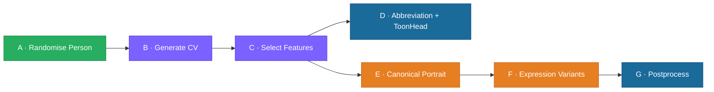
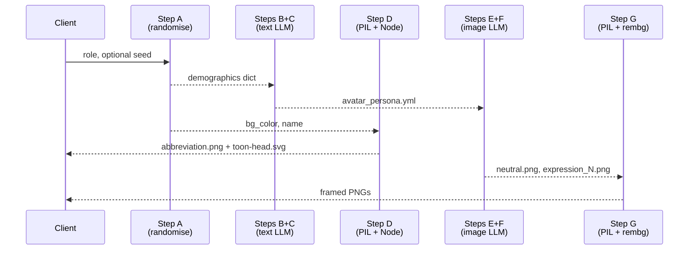

# Avatar Studio — Architecture

**Project**: avatar-studio — standalone avatar generation package
**Date**: 2026-04-02
**Version**: 0.1.0

---

## Table of Contents

1. [Overview](#1-overview)
2. [Pipeline Stages (A→G)](#2-pipeline-stages-ag)
3. [Package Structure](#3-package-structure)
4. [Data Flow](#4-data-flow)
5. [LLM Usage](#5-llm-usage)
6. [Tuning System](#6-tuning-system)
7. [API Layer](#7-api-layer)

---

## 1. Overview

Avatar Studio generates avatars through a 7-stage pipeline. Each stage is independently testable; the pipeline can be run end-to-end or stage-by-stage.

All LLM calls are routed through the LLM Gateway at `http://127.0.0.1:4096`.



---

## 2. Pipeline Stages (A→G)

| Stage | Module | What it does | LLM? |
|-------|--------|--------------|:----:|
| **A** | `pipeline/step_a_randomise_person.py` | Random demographics, name, phenotype colors | ❌ |
| **B** | `pipeline/step_b_generate_cv.py` | Education, experience, traits from role | ✅ text |
| **C** | `pipeline/step_c_select_features.py` | Hair style, clothing, accessories per-field | ✅ text |
| **D** | `pipeline/step_d_make_abbreviation.py` + `pipeline/step_d_make_toon_head.py` | Initials PNG (PIL) + ToonHead SVG (DiceBear, Node) | ❌ |
| **E** | `pipeline/step_ef_generate_image.py` | Neutral portrait from full persona | ✅ image |
| **F** | `pipeline/step_ef_generate_image.py` | Expression variants from neutral reference | ✅ image |
| **G** | `pipeline/step_g_postprocess.py` | Circle frame sticker composite (PIL + rembg) | ❌ |

### Stage A — Randomise Person

Produces a `demographics` dict with:
- Identity: `gender`, `age`, `name`
- Style: `style`, `bg_color`, `fg_color`
- Phenotype colors: `SKIN_TONE`, `HAIR_COLOR`, `EYE_COLOR`, `BROWS_COLOR`
- Shape fields: `EYE_SHAPE`, `BROWS_STYLE`, `NOSE_SHAPE`, `CHIN_SHAPE`, `CHEEKS_SHAPE`

All values drawn uniformly from the palettes in `assets/persona/phenotype_settings.json`. No LLM involved.

### Stage B — Generate CV

Calls a text LLM once to produce `education`, `experience`, `traits`. Retries up to `max_retries` on empty or malformed responses.

### Stage C — Select Features

One LLM call per field: `HAIR_STYLE`, `CLOTHING` (dict), `ACCESSORIES` (dict). Phenotype fields are pre-seeded from Stage A demographics — no LLM needed for them. Context accumulates across fields so each pick is consistent with the emerging persona.

### Stage D — Abbreviation + ToonHead Avatars

Two fast, code-only avatars are generated in parallel before any LLM call:

1. **Abbreviation** — PIL renders initials on a WCAG-AA-compliant colored circle. Deterministic; no network calls. Output: `<slug>-abbreviation.png`.
2. **ToonHead** — DiceBear `big-smile` style SVG, generated via `vendor/toon-head/generate.js` (Node.js subprocess). Seed = person name → same name always produces the same avatar. Output: `<slug>-toon-head.svg`. ToonHead failure is non-fatal; the pipeline continues without it.

### Stage E — Canonical Portrait

Single Ollama image model call. Input: `persona.yml` + style directive + `neutral` expression. Output: PNG.

### Stage F — Expression Variants

One Ollama image model call per expression. Sends the Stage E portrait as a reference image so the model preserves identity across expressions.

### Stage G — Postprocess

`rembg` removes the portrait background; PIL composites it over a colored circle with a white sticker border.

---

## 3. Package Structure

```
src/avatar_studio/
├── config/
│   ├── config.py           # Settings, WCAG utils, color helpers
│   └── gateway.py          # LLM Gateway client
├── pipeline/
│   ├── step_a_randomise_person.py
│   ├── step_b_generate_cv.py
│   ├── step_c_select_features.py
│   ├── step_d_make_abbreviation.py
│   ├── step_d_make_toon_head.py
│   ├── step_ef_generate_image.py
│   └── step_g_postprocess.py
├── api/
│   ├── server.py            # process_advisor, model resolution helpers
│   └── cli.py               # CLI entry point (avatar-studio command)
└── tuning/
    ├── classify_expression.py
    ├── classify_style.py
    ├── classify_persona.py
    ├── expression_tuner.py  # avatar-expression-tuner CLI
    └── style_tuner.py       # avatar-style-tuner CLI
assets/
├── expressions/
│   └── expressions.yml               # Expression definitions: FACS, synonyms, descriptions
├── persona/
│   ├── cv_settings.json              # Step B: LLM params + CV schema
│   ├── phenotype_settings.json       # Step A: age groups, names, phenotype options, palette
│   └── presentation_settings.json   # Step C: LLM params + hair/clothing/accessories options
└── styles/
    ├── styles.yml                    # Style definitions: system prompts, technical traits
    └── avatar_style_<style>_<gender>.png  # 15 reference PNGs (5 styles × 3 genders)
tests/
├── conftest.py
├── test_avatar_features.py       # Step B/C: LLM mocks, feature selection
├── test_avatar_integration.py    # Integration tests (require OLLAMA_URL)
└── test_avatar_stages.py         # Step A/D/E/F: randomise, PIL, create_face_avatar
```

---

## 4. Data Flow



---

## 5. LLM Usage

All LLM calls go through the **LLM Gateway** (`config/gateway.py`, default `http://127.0.0.1:4096`). The pipeline never calls model endpoints directly. The gateway exposes three endpoints used by avatar-studio:

| Gateway endpoint | Protocol | Used by |
|-----------------|----------|---------|
| `POST /text_gen` | `{messages, max_retries}` → `{content}` | Steps B, C |
| `POST /image_gen` | `{prompt, width, height, seed?, reference_images_b64?}` → `{image_b64}` | Steps E, F |
| `POST /image_inspector` | `{image_b64, system, prompt, max_retries}` → `{content}` | Classifiers |
| `GET /api/tags` | — → `{models: [{name}]}` | Model discovery (startup) |

### Per-stage breakdown

| Step | Gateway endpoint | Key inputs | Output |
|------|-----------------|------------|--------|
| B | `POST /text_gen` | Role + demographics as messages | YAML: education / experience / traits |
| C | `POST /text_gen` | Profile + selected-so-far as messages (one call per field) | One field value per call |
| E | `POST /image_gen` | Prompt from `persona.yml` + style directive; no reference image | PNG portrait (neutral) |
| F | `POST /image_gen` | Same prompt + `reference_images_b64` = Step E portrait | PNG expression variant |
| Classifiers | `POST /image_inspector` | Generated PNG + system prompt with label hints | YAML scores |

Model selection and gateway URL are resolved at runtime from `assets/persona/cv_settings.json` and `assets/persona/presentation_settings.json`.

---

## 6. Tuning System

Two CLI tuners iteratively validate that generated avatars match their intended style or expression.

### Style Tuner (`avatar-style-tuner`)

```
for each style:
    generate portrait → classify style → report pass/fail
```

Pass: classifier's `top_style_id` matches the intended style.

### Expression Tuner (`avatar-expression-tuner`)

```
for each expression:
    generate portrait → classify expression → check exact match or synonym match
    → semantic fallback via LLM per-phrase check
```

Pass: classifier top expression matches label (exact or semantic), probability ≥ threshold.

---

## 7. API Layer

`api/server.py` provides `process_advisor()` — the end-to-end function used by the CLI and the dashboard's FastAPI integration.

`api/cli.py` exposes three sub-commands via the `avatar-studio` entry point:

| Sub-command | What it does |
|-------------|--------------|
| `stage-b` | Run Step B only (LLM feature selection), print YAML |
| `generate` | Full A→G pipeline for one or more advisor YAML files |
| `gen-examples` | Generate style reference portraits (all styles × genders) |
