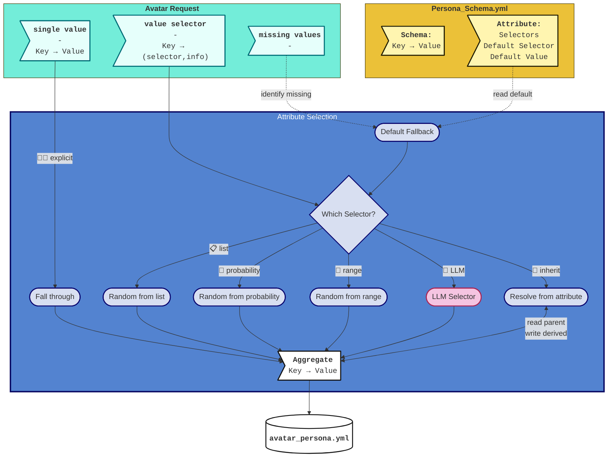
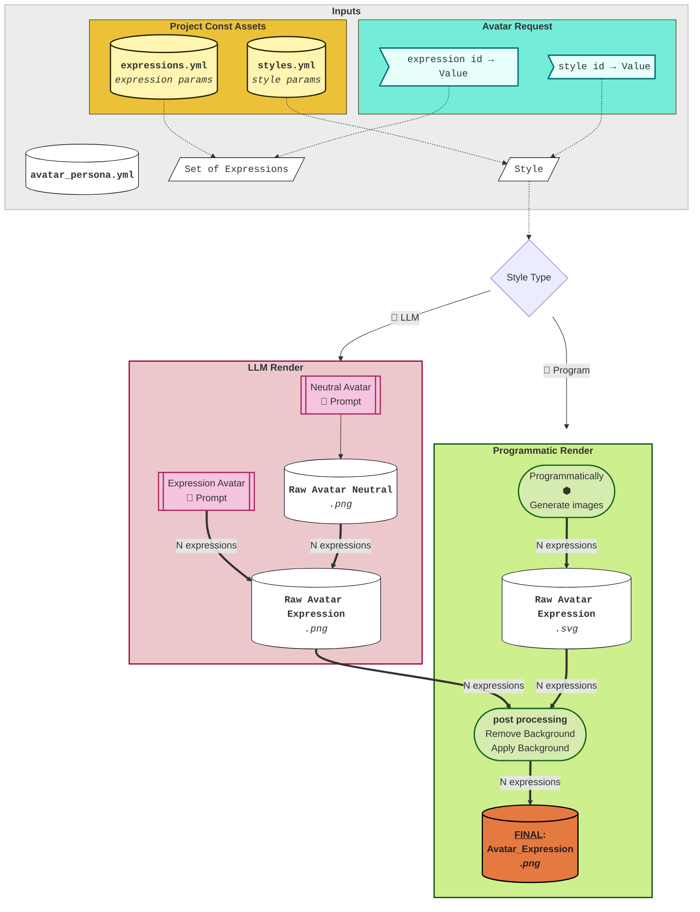

# Avatar Studio — Software Architecture / Avatar Pipeline

**Project**: avatar-studio — standalone avatar generation package
**Date**: 2026-04-04
**Version**: 0.1.0

---

## Table of Contents

1. [Input](#1-input)
2. [Output](#2-output)
3. [Avatar Creation Pipeline](#3-avatar-creation-pipeline)
   - [3.1 Generate Avatar Persona](#31-generate-avatar-persona)
   - [3.2 Render Avatars](#32-render-avatars)
4. [Validation](#4-validation)
   - [4.1 Scorers Overview](#41-scorers-overview)
   - [4.2 Expression Classifier](#42-expression-classifier)
   - [4.3 Style Classifier](#43-style-classifier)
   - [4.4 Persona Categorizer](#44-persona-categorizer)


---

## 1. Input

**Avatar Request** - The input for the avatar pipeline is a key-value dictionary, where:
- Key is the name of the attribute
- Value is a selector, of one of the following types:
  - single value
  - a list of values
  - a range of values
  - probability dict
    - a dict of values and their corresponding probabilities (must sum to 1)
  - per-another-attribute key-value
    - parent attribute name
    - attribute:value dictionary
  - 🤖 LLM Selector

The following rendering parameters are mandatory:

| Parameter | Description |
|---|---|
| **Artistic Style** | Which visual style to render |
| **Expression ID** | Which expression(s) to generate [^expression-id] |
| **Image Size** | Output pixel dimensions (width = height) |
| **Background Style** | How to composite the background [^bg-style] |
| **Background Color** | Hex color used for the background element |

[^expression-id]: Accepts four forms: a single expression name (e.g. `"happiness"`), a list of names (e.g. `["happiness", "anger"]`), `"all"` (generate every defined expression), or `"random"` (pick one at random).

[^bg-style]: Currently only `round-fill` is supported — a solid-color circle composited behind the portrait. Additional background styles (gradient, transparent, full-bleed) are planned for a future phase.

**Frontend - User**
Our Frontend (future, TBD) will allow user to select for each of the attributes, using ✏️ Manual, 🎲 Random or 🤖 LLM pick methods:


## 2. Output

A **set** of PNGs, each:
- represent and identifiable as the same person
- mimics a facial expression

Every PNG also carries the following metadata:
```yml
- avatar-studio:
    - date
    - version
- attributes:
    - artistic-style
    - gender
    - age
    - name
    - ...
- expression-id
- if LLM-created:
    - model name and version
    - prompt
- if programmatically-created:
    - credits according to package usage
- acceptance-scores:
    - style-fidelity
    - expression-clarity
    - ...
- generation-time-ms  # includes acceptance gate passes
```

## 3. Avatar Creation Pipeline

### 3.1 Generate Avatar Persona

Input: **Avatar Request**
Output:  **Avatar Persona**

### Persona Attributes collection



### 3.2 Render Avatars

Input: **Avatar Persona**
Output:  **Avatar Image**



## 4. Validation

Validation runs after render. Three independent scorers operate on the final PNG and write their results to the `acceptance-scores` field in the output metadata (see §2). Scores are informational — the library returns them; the caller decides what to do with them.

### 4.1 Scorers Overview

| Scorer | Product criterion (avatars.md §6) | Module |
|---|---|---|
| Expression Classifier | §6.3 Expression Clarity | `tuning/classify_expression.py` |
| Style Classifier | §6.4 Style Fidelity | `tuning/classify_style.py` |
| Persona Categorizer | §6.2 Phenotype Fidelity, §6.1 Identity Consistency | `tuning/classify_persona.py` |
| Technical Quality | §6.5 Technical Quality | *not yet implemented* |

---

### 4.2 Expression Classifier

**Module**: `tuning/classify_expression.py`
**Entry point**: `classify_image_expression(image_bytes, expression_labels, *, gateway_url, timeout)`

Asks a vision LLM to identify which facial expressions are visible in the image. The classifier operates **blind** — it receives only plain label names as soft hints, never FACS specs or generation instructions.

**Output — `ExpressionClassificationResult`**:

| Field | Type | Description |
|---|---|---|
| `top_expression` | `str` | Label with the highest score |
| `scores` | `dict[str, float]` | 5–10 expression labels → probability (sum ≈ 1.0) |
| `reasoning` | `str` | One-sentence visual observation |
| `raw_response` | `str` | Raw LLM YAML for debugging |

**Pass evaluation — two paths**:

1. **Direct match**: `top_expression` matches the expected label (case-insensitive) AND `top_score ≥ 0.35`
2. **Semantic fallback** (`semantic_effective_score()`): sums probabilities of all classifier output labels that a text-LLM judges semantically equivalent to the expected label (separate yes/no call per label). Allows synonyms — e.g. `"joyful"` counting toward `"happiness"`.

If neither path passes, the expression score is the semantic effective score (float 0.0–1.0); the caller uses this to decide acceptance.

---

### 4.3 Style Classifier

**Module**: `tuning/classify_style.py`
**Entry point**: `classify_image_style(image_bytes, styles, *, gateway_url, timeout)`

Asks a vision LLM to identify which style from `styles.yml` the image best represents. Each style's `key_technical_traits` list is provided as discriminating criteria. Styles without `key_technical_traits` and the `random` pseudo-style are automatically excluded.

**Output — `StyleClassificationResult`**:

| Field | Type | Description |
|---|---|---|
| `top_style_id` | `str` | Style ID with the highest score |
| `scores` | `dict[str, float]` | style_id → score for all checkable styles |
| `reasoning` | `str` | One-sentence visual evidence |
| `raw_response` | `str` | Raw LLM YAML for debugging |

**Pass evaluation**: `top_style_id == expected_style_id`

---

### 4.4 Persona Categorizer

**Module**: `tuning/classify_persona.py`
**Entry point**: `categorize_avatar_image(image_bytes, persona, *, gateway_url, timeout)`

Verifies which visual properties from `avatar_persona.yml` are present in the image. Two scoring methods are used depending on property type:

**Color properties** — `skin_tone`, `hair_color`, `eye_color`, `clothing`:
- VLM reports `observed_hex` (`#RRGGBB`) for the dominant color of each property
- Pass/fail is determined **programmatically** by YCbCr Euclidean distance ≤ 55.0 between observed and expected hex
- YCbCr is used instead of RGB to tolerate lighting variation while catching genuine color-family mismatches (e.g. dark brown vs blue)
- The LLM's own `visible` flag is overridden by the distance check when an `observed_hex` is present

**Structural properties** — `gender`, `hair_style`, `eye_shape`, `brows_style`, `nose_shape`, `chin_shape`, `cheeks_shape`, `accessories`:
- VLM binary `visible: true/false` decision with a one-sentence observation note
- No objective distance check; LLM assessment only

**Output — `CategoryReport`**:

| Field | Type | Description |
|---|---|---|
| `results` | `list[PropertyResult]` | Per-property: `property_name`, `expected`, `visible: bool`, `note` |
| `score` | `float` | Fraction of passing properties (0.0–1.0) |
| `raw_response` | `str` | Raw LLM YAML for debugging |

Mandatory phenotype attributes (SKIN_TONE, HAIR_COLOR) are among the color properties that receive the YCbCr objective check. All other attributes are best-effort (LLM judgment only).


### A — Randomize Person

> **Design intent:** demographic and phenotype traits are selected **uniformly at random**
> from equal-weight lists. No group is favored or disfavored. The categories
> exist solely as visual descriptors to guide the image model — they are not
> identity labels and do not represent real-world population ratios. The goal
> is visual variety across a set of generated personas, not demographic modelling.

Personal fields are randomized at generation time (not seeded from the advisor
name). When re-generating an advisor, fresh random values are chosen.

**DEMO** fields:
- **NAME** — generated full name
- **GENDER** — uniform random pick from: male, female, non-binary
- **AGE** — uniform random integer 25–70

**PHENO** fields (all randomized in this step):
- **Color picks** — **SKIN_TONE**, **HAIR_COLOR**, **EYE_COLOR**, **BROWS_COLOR** — uniform random picks
- **Shape picks** — **EYE_SHAPE**, **BROWS_STYLE**, **NOSE_SHAPE**, **CHIN_SHAPE**, **CHEEKS_SHAPE** — uniform random picks
- **BG_COLOR** — uniform random pick from PALETTE (same palette used for abbreviation avatars)

This step is pure randomization in code — no LLM call is made.

---

### B — Generate CV

> **Design intent:** given the role/persona description and the avatar's age from §A,
> an LLM call generates a character profile. This enables the
> **multi-candidate** flow where the system produces diverse candidates from
> a single persona input, with each candidate receiving a distinct background.

An LLM call generates a YAML profile with three keys:

- **education** — 1–2 items (degrees, certifications)
- **experience** — 1–2 items (years and domain)
- **traits** — 2–3 personality traits

#### Model call parameters:
- **Temperature**: 0.7 (encourages diversity across candidates)
- **Max tokens**: 512
- **Max retries**: 10
- **Inputs**: USER_ROLE, DEMO:AGE

---

### C — Presentation

> **Design intent:** given the advisor's CV, phenotype, and demographics, an LLM
> call selects the presentation details that complete the visual persona.
> Temperature *0.5* balances consistency with natural variation — coherent choices
> that still differ meaningfully across candidates.

#### Model call parameters:
- **Temperature**: 0.5
- **Max tokens**: 1024
- **Max retries**: 10
- **Inputs**: CV (§B), PHENO (§A), DEMO (§A)

**PRESENT** output fields:
- **HAIR_STYLE** — e.g. short wavy, bun, cropped
- **CLOTHING** — attire selection appropriate to the persona and style
- **ACCESSORIES** — optional discreet items (glasses, earring, timepiece)

Prompts and output schema are defined in `avatar_studio_settings.json`.

> After §C completes, DEMO + PHENO + CV + PRESENT are marshaled into a single
> `avatar_persona` dict — the **single source of truth** for image prompts and
> the UI panel display.

---

### D — Abbreviation + ToonHead Avatars

> **Design intent:** two lightweight code-generated avatars are produced in
> parallel so the UI always has something to display while the image model runs.

#### D.1 — Abbreviation

Generated by **Pillow** (no LLM call):

- **Inputs**: DEMO:NAME (for initials), PHENO:BG_COLOR (background), `#FFFFFF` foreground
- **Output**: `<slug>-abbreviation.png` — square raster, initials centered on solid background circle

#### D.2 — Programmatic Avatar (PA)

Generated by **DiceBear** (multi-style, CC BY 4.0) via a vendored Node.js
sub-project (`vendor/programmatic-avatar/`). No LLM call; deterministic from the person's name.

- **Inputs**: DEMO:NAME (seed), PHENO:BG_COLOR (background color option)
- **Output**: `<slug>-toon-head.svg` — scalable cartoon head SVG
- **Failure behavior**: non-fatal — the pipeline continues without it if Node.js is unavailable

---

### E — Canonical Portrait

This is the **identity prompt** — it fully defines what the person looks like.
It is called once and produces the neutral portrait that all expression variants
will reference.

Image models use a single combined `prompt.txt` (no separate system/user prompt files).

*where*:
{avatar_persona.yml} - replace by a (properly indented) dump of `avatar_persona.yml`
{expressions.yml:{expression}} - replace by a (properly indented) dump of `expressions.yml:neutral`

---

### F — Expression Avatars

This prompt is sent **together with the neutral portrait image** (base64 in
Ollama's `images` field). It asks the model to re-render the same person with a
different expression.

Image models use a single combined `prompt.txt` (no separate system/user prompt files).

*where*:
{avatar_persona.yml} - replace by a (properly indented) dump of `avatar_persona.yml`
{expressions.yml:{expression}} - replace by a (properly indented) dump of `expressions.yml:{expression}`


---

### G — Apply Avatar on Background

> **Design intent:** Highlight the portrait, while providing color-background for fast-recognising.
> **Design style**

> Remove any background generated in the previous LLM-image generation
> Portrait covers ~ 90% of the picture vertical (~425px), highlighted by a 6-pixel width white "sticker" margins
> `BG_COLOR` circle in the back with radius of 33% of the image (~350x350px)

Generated by **Pillow** (no LLM call):

- **Inputs**: temporary files of avatars + expressions
- **Output**: `avatar_expression.png` files

