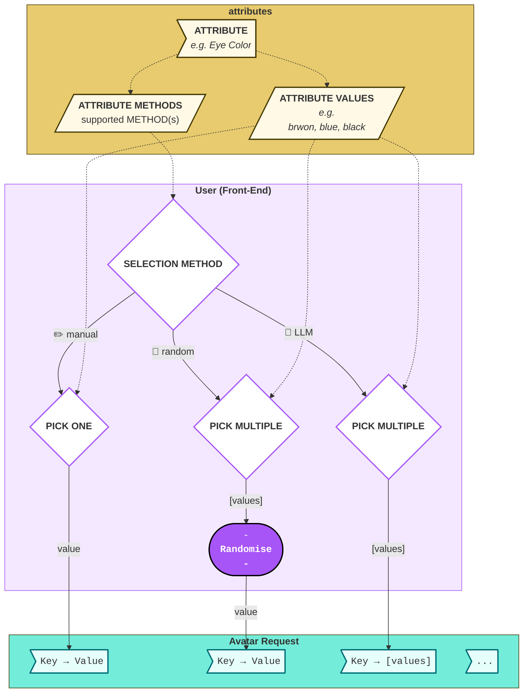

# Avatar Studio — Software Architecture / Avatar Pipeline

**Project**: avatar-studio — standalone avatar generation package
**Date**: 2026-04-04
**Version**: 0.1.0

---

## Table of Contents

1. [Input](#1-input)
2. [Output](#2-output)
3. [Avatar Creation Pipeline](#3-avatar-creation-pipeline)
   - [3.1 Generate Avatar Persona](#31-generate-avatar-persona)
   - [3.2 Render Avatars](#32-render-avatars)
     - [Programmatic Avatar](pipeline/render/avatar_render_programmatic.md)
     - [Neutral Portrait](pipeline/render/avatar_render_llm_neutral_portrait.md)
     - [Expression Variants](pipeline/render/avatar_render_llm_expression_variants.md)
     - [Post-process / Apply Background](pipeline/render/avatar_postprocessor.md)
4. [Validation](#4-validation)
   - [4.1 Scorers Overview](#41-scorers-overview)
   - [4.2 Expression Classifier](pipeline/scoring_expression_classifier.md)
   - [4.3 Style Classifier](pipeline/scoring_style_classifier.md)
   - [4.4 Persona Categorizer](pipeline/scoring_persona_categorizer.md)
5. [Appendix A — Data Structures](#appendix-a--data-structures)
   - [A.1 Avatar Request](#a1-avatar-request)
   - [A.2 Avatar Persona](#a2-avatar-persona)
   - [A.3 PNG Metadata](#a3-png-metadata)

---

## 1. Input

The input to the avatar pipeline is an **Avatar Request** (see [Appendix A.1](#a1-avatar-request)).

The following rendering parameters are mandatory:

| Parameter | Description |
|---|---|
| **Artistic Style** | Which visual style to render [^style-id] |
| **Expression IDs** | Which expression(s) to generate [^expression-id] |
| **Image Size** | Output pixel dimensions (width = height) |
| **Background Style** | How to composite the background [^bg-style] |
| **Background Color** | Hex color used for the background element |

[^style-id]: Any style ID defined in `assets/styles/styles.yml` — e.g. `"studio_3d"`, `"photorealistic"`, `"toon-head"`.

[^expression-id]: Accepts four forms: a single expression name (e.g. `"happiness"`), a list of names (e.g. `["happiness", "anger"]`), `"all"` (generate every defined expression), or `"random"` (pick one at random). The reason we need the IDs in a single request is to be able to identify all expressions-avatars as the same person.

[^bg-style]: Currently only `transparent`, `color-fill`, `round-fill` are to be supported. Additional background styles (gradient, full-bleed) provision is advised.

## 1.1 API, Test and Package users

This library is mainly an API / package utilitiy.
The main user would convey the **Avatar Request** as a file, or via APIs

## 1.2 Frontend - User
Frontend (minimal implementation for manual testing) allows the user to select for each of the attributes, using ✏️ Manual, 🎲 Random or 🤖 LLM pick methods:



## 2. Output

A **set** of PNGs, each representing the same person in a distinct facial expression.

Every PNG carries embedded metadata — see [Appendix A.3](#a3-png-metadata).

---

## 3. Avatar Creation Pipeline

### 3.1 Generate Avatar Persona

Input: **Avatar Request** (see [Appendix A.1](#a1-avatar-request))
Output: **Avatar Persona** (see [Appendix A.2](#a2-avatar-persona))

The persona generation phase resolves all avatar attributes from the **Avatar Request** into concrete values, producing **Avatar Persona** — the single source of truth consumed by the upcoming avatar-rendering steps.

### 3.1.1 Generate Avatar Persona - Flowchart


### 3.1.2 Order of Attribute Resolving

1. Attributes **Missing 🫥** from the request - pre-pass that assigns the schema default (selector/value) for any missing attribute
2. Attributes with a **Single Value** (i.e. ☝🏻 explicit) pass through unchanged.
*e.g. 'Eye Color' : 'Green'*
3. Attributes with **Random Selectors** (i.e. 📋 uniform, 🎲 probability, 🎯 range)
*e.g. 'Age' : range(25,70)*
4. Attributes **Generated by LLM 🤖** - may implicitly depend on other attributes
*e.g. 'Brows Color' may implicitly inherit from 'Age', 'Hair Color'*
5. Attributes whose value **Explicitly Inherited 🔗** by other attributes.
*e.g. 'First Name' is random pick of a list derived by 'Gender'*

> note: Explicitly Inherited attributes can't depend on other similarily-inherited attribute, as the order of their evaluation is undefined 

The result is a fully concrete **Avatar Persona** — every attribute has exactly one resolved value. No selectors remain at this point; the persona is ready for rendering.

### 3.1.3 Multiple-Selection Types

Attribute with more than one optional value may be selected with any of the following strategies:
- 📋 **Uniform Random Pick** from a list
- 🎯 **Uniform Random Pick** from a range (integer / color)
- 🎲 **Probability Random Pick** where the probability for each value is given.
- 🤖 **LLM Pick** The LLM input will include all attributes resolved so far (steps 1-3 [above](#312-order-of-attribute-resolving)) and restricted format by a schema.

### 3.1.4 Unit-level Breakdown

- [avatar_persona_generator](pipeline/persona/avatar_persona_generator.md)
  - [avatar_persona_schema](pipeline/persona/avatar_persona_schema.md)
  - [avatar_request_serve](pipeline/api/avatar_request_serve.md)
    - [avatar_request_api](pipeline/api/avatar_request_api.md)
    - [avatar_request_validate_input](pipeline/api/avatar_request_validate_input.md)
    - [avatar_request_identify_missing](pipeline/api/avatar_request_identify_missing.md)
      - [avatar_persona_default_fallback](pipeline/persona/avatar_persona_default_fallback.md)
    - [avatar_request_identify_explicits](pipeline/api/avatar_request_identify_explicits.md)
      - [avatar_persona_aggregator_fallthrough](pipeline/persona/avatar_persona_aggregator_fallthrough.md)
    - [avatar_request_parse_selector](pipeline/api/avatar_request_parse_selector.md)
      - [avatar_persona_aggregator_random_from_list](pipeline/persona/avatar_persona_aggregator_random_from_list.md)
      - [avatar_persona_aggregator_random_from_range](pipeline/persona/avatar_persona_aggregator_random_from_range.md)
        - [avatar_persona_aggregator_random_from_range_color](pipeline/persona/avatar_persona_aggregator_random_from_range_color.md)
      - [avatar_persona_aggregator_random_from_probability](pipeline/persona/avatar_persona_aggregator_random_from_probability.md)
      - [avatar_persona_aggregator_from_llm](pipeline/persona/avatar_persona_aggregator_from_llm.md)
      - [avatar_persona_aggregator_from_inherited](pipeline/persona/avatar_persona_aggregator_from_inherited.md)
    - [avatar_persona_marshal](pipeline/persona/avatar_persona_marshal.md)

### 3.1.5 Unit Tests
The whole unit is unit-testable, except for LLM Generation.
Since the mock to LLM generation will be random, it is unnecessary and can be marked as Intentionally skipped (low ROI).

---

### 3.2 Render Avatars

Input: **Avatar Persona** (`avatar_persona.yml`)
Output: **Avatar Images** (final PNGs per expression)

### 3.2.1 Render Avatars — Flowchart


### 3.2.2 Render Sequence

1. **Style resolution** — `style_id` is looked up in `styles.yml`; determines render family (LLM or Programmatic) and loads the style directive or component configuration.
2. **Expression set resolution** — `expression_id` is resolved to a concrete list of expression names: single name, explicit list, `"all"` (every expression in `expressions.yml`), or `"random"` (one uniform pick).
3. **Path branch on style family** — LLM styles → LLM render; Programmatic styles → Programmatic render.

4. (🤖) **LLM — Neutral Portrait** · [SRS →](pipeline/render/avatar_render_llm_neutral_portrait.md) — one image model call; establishes visual identity. Prompt combines the style directive, a sanitized persona YAML, and the neutral expression.[^persona-sanitize] Output PNG is the reference image for all expression variants.
5. (🤖) **LLM — Expression Variants** · [SRS →](pipeline/render/avatar_render_llm_expression_variants.md) — N calls (one per non-neutral expression), each receiving the neutral portrait as a reference image to anchor identity.[^ref-img-f] Individual failures are non-fatal.
6. (🐍) **Programmatic — Expression Set** · [SRS →](pipeline/render/avatar_render_programmatic.md) — N SVG generations via DiceBear (Node.js), seeded deterministically from the persona name. Expression controlled by pre-mapped component overrides — no neutral reference needed. Failure is non-fatal.
7. (🐍) **Post-processing** - transforming SVG to PNG
8. **Post-processing** · [SRS →](pipeline/render/avatar_postprocessor.md) — applied to outputs from both paths: background removal (LLM path only) then composite layout.[^no-bg-in-style]

[^persona-sanitize]: Text-heavy fields (name, CV, traits) are excluded from the image prompt — the model may render them as literal text. `eye_shape` is excluded because rendering is owned by the style system prompt; persona-level eye shape would conflict.

[^ref-img-f]: Without the reference image the model generates a different-looking person for each expression. The reference anchors hair, skin, and facial structure while allowing the expression signal to vary.

[^no-bg-in-style]: Style system prompts deliberately omit background instructions. A background in the raw output would conflict with background removal in post-processing, producing a doubled or inconsistent result in the final composite.

### 3.2.3 Render Families

| | **🤖 LLM** | **🐍 Programmatic** |
|---|---|---|
| Driven by | Image model + style system prompt | DiceBear component library (Node.js) |
| Raw output format | PNG | SVG |
| Expression control | FACS codes + description in prompt | Pre-mapped component variants (eyes, mouth, brows) |
| Identity anchor | Neutral portrait passed as reference image | Name seed — same name always produces same avatar |
| Deterministic | No | Yes (except `opeeps` style) |
| Persona applied | Full visual persona YAML | `bg_color` only |
| Failure granularity | Per-expression (one failure doesn't block others) | Whole path (Node.js unavailable → no programmatic output) |

### 3.2.4 Unit-level Breakdown

- [avatar_renderer](pipeline/render/avatar_renderer.md)
  - [avatar_render_style_resolver](pipeline/render/avatar_render_style_resolver.md)
  - [avatar_render_expression_resolver](pipeline/render/avatar_render_expression_resolver.md)
  - [avatar_render_llm](pipeline/render/avatar_render_llm.md)
    - [avatar_render_llm_prompt_builder](pipeline/render/avatar_render_llm_prompt_builder.md)
      - [avatar_render_llm_persona_sanitizer](pipeline/render/avatar_render_llm_persona_sanitizer.md)
      - [avatar_render_llm_style_directive](pipeline/render/avatar_render_llm_style_directive.md)
      - [avatar_render_llm_facs_resolver](pipeline/render/avatar_render_llm_facs_resolver.md)
    - [avatar_render_llm_neutral_portrait](pipeline/render/avatar_render_llm_neutral_portrait.md)
    - [avatar_render_llm_expression_variants](pipeline/render/avatar_render_llm_expression_variants.md)
  - [avatar_render_programmatic](pipeline/render/avatar_render_programmatic.md)
    - [avatar_render_programmatic_expression_mapper](pipeline/render/avatar_render_programmatic_expression_mapper.md)
    - [avatar_render_programmatic_svg_generator](pipeline/render/avatar_render_programmatic_svg_generator.md)
  - [avatar_postprocessor](pipeline/render/avatar_postprocessor.md)
    - [avatar_postprocessor_svg_2_png](pipeline/render/avatar_postprocessor_svg_2_png.md)
    - [avatar_postprocessor_background_remover](pipeline/render/avatar_postprocessor_background_remover.md)
    - [avatar_postprocessor_compositor](pipeline/render/avatar_postprocessor_compositor.md)
      - [avatar_postprocessor_metadata](pipeline/render/avatar_postprocessor_metadata.md)

### 3.2.5 Testability

- `avatar_render_style_resolver` and `avatar_render_expression_resolver` are pure lookups — fully unit-testable.
- `avatar_render_llm_prompt_builder` and its children (`persona_sanitizer`, `style_directive`, `facs_resolver`) are pure functions — fully unit-testable.
- `avatar_render_llm_neutral_portrait` and `avatar_render_llm_expression_variants` make image model calls — integration-test only; mock at the gateway boundary.
- `avatar_render_programmatic_svg_generator` calls Node.js subprocess — integration-test only; mock at subprocess boundary or use a fixture SVG.
- `avatar_postprocessor_background_remover` depends on rembg ONNX model — integration-test; can be mocked with a pre-removed fixture image.
- `avatar_postprocessor_compositor` is pure Pillow — fully unit-testable with fixture images.

---

## 4. Validation

Validation runs after render. Three independent scorers operate on each final PNG and write their results to the `acceptance-scores` field in the output metadata (see [Appendix A.3](#a3-png-metadata)). Scores are informational — the library returns them; the caller decides what to do with them (retry, warn, reject).

### 4.1 Scorers Overview

| Scorer | Product criterion ([avatars.md §6](../product/avatars.md#6-acceptance-gate)) | Module | Detailed SRS |
|---|---|---|---|
| Expression Classifier | §6.3 Expression Clarity | `tuning/classify_expression.py` | [→](pipeline/scoring_expression_classifier.md) |
| Style Classifier | §6.4 Style Fidelity | `tuning/classify_style.py` | [→](pipeline/scoring_style_classifier.md) |
| Persona Categorizer | §6.2 Phenotype Fidelity, §6.1 Identity Consistency | `tuning/classify_persona.py` | [→](pipeline/scoring_persona_categorizer.md) |
| Technical Quality | §6.5 Technical Quality | *not yet implemented* | — |

---

### 4.2 Expression Classifier

**Module**: `tuning/classify_expression.py`
**Entry point**: `classify_image_expression(image_bytes, expression_labels, *, gateway_url, timeout)`
**[Full SRS →](pipeline/scoring_expression_classifier.md)**

Asks a vision LLM to identify which facial expressions are visible in the image. The classifier operates **blind** — it receives only plain label names as soft hints, never FACS specs or generation instructions.

**Output — `ExpressionClassificationResult`**:

| Field | Type | Description |
|---|---|---|
| `top_expression` | `str` | Label with the highest score |
| `scores` | `dict[str, float]` | 5–10 expression labels → probability (sum ≈ 1.0) |
| `reasoning` | `str` | One-sentence visual observation |
| `raw_response` | `str` | Raw LLM YAML for debugging |

**Pass evaluation — two paths**:

1. **Direct match**: `top_expression` matches the expected label (case-insensitive) AND `top_score ≥ 0.35`[^expr-threshold]
2. **Semantic fallback** (`semantic_effective_score()`): sums probabilities of all classifier output labels that a text-LLM judges semantically equivalent to the expected label (separate yes/no call per label). Allows synonyms — e.g. `"joyful"` counting toward `"happiness"`.

If neither path passes, the expression score is the semantic effective score (float 0.0–1.0); the caller uses this to decide acceptance.

[^expr-threshold]: Threshold 0.35 was chosen empirically during tuning. It passes clearly rendered expressions while filtering diffused scores (0.15–0.20) caused by ambiguous renderings.

---

### 4.3 Style Classifier

**Module**: `tuning/classify_style.py`
**Entry point**: `classify_image_style(image_bytes, styles, *, gateway_url, timeout)`
**[Full SRS →](pipeline/scoring_style_classifier.md)**

Asks a vision LLM to identify which style from `styles.yml` the image best represents. Each style's `key_technical_traits` list is provided as discriminating criteria. Styles without `key_technical_traits` and the `random` selector are automatically excluded.[^style-filter]

**Output — `StyleClassificationResult`**:

| Field | Type | Description |
|---|---|---|
| `top_style_id` | `str` | Style ID with the highest score |
| `scores` | `dict[str, float]` | style_id → score for all checkable styles |
| `reasoning` | `str` | One-sentence visual evidence |
| `raw_response` | `str` | Raw LLM YAML for debugging |

**Pass evaluation**: `top_style_id == expected_style_id` (exact match, no threshold).

[^style-filter]: `random` has no visual definition and cannot be classified. Styles without `key_technical_traits` are excluded because the classifier has no discriminating criteria to apply.

---

### 4.4 Persona Categorizer

**Module**: `tuning/classify_persona.py`
**Entry point**: `categorize_avatar_image(image_bytes, persona, *, gateway_url, timeout)`
**[Full SRS →](pipeline/scoring_persona_categorizer.md)**

Verifies which visual properties from `avatar_persona.yml` are present in the image. Two scoring methods are used depending on property type:

**Color properties** — `skin_tone`, `hair_color`, `eye_color`, `clothing`:
- VLM reports `observed_hex` (`#RRGGBB`) for the dominant color of each property
- Pass/fail is determined **programmatically** by YCbCr Euclidean distance ≤ 55.0 between observed and expected hex[^ycbcr-main]
- The LLM's own `visible` flag is overridden by the distance check when an `observed_hex` is present

**Structural properties** — `gender`, `hair_style`, `eye_shape`, `brows_style`, `nose_shape`, `chin_shape`, `cheeks_shape`, `accessories`:
- VLM binary `visible: true/false` decision with a one-sentence observation note
- No objective distance check; LLM assessment only

**Output — `CategoryReport`**:

| Field | Type | Description |
|---|---|---|
| `results` | `list[PropertyResult]` | Per-property: `property_name`, `expected`, `visible: bool`, `note` |
| `score` | `float` | Fraction of passing properties (0.0–1.0) |
| `raw_response` | `str` | Raw LLM YAML for debugging |

Mandatory phenotype attributes (SKIN_TONE, HAIR_COLOR) are among the color properties that receive the YCbCr objective check. All other attributes are best-effort (LLM judgment only).

[^ycbcr-main]: YCbCr separates luminance from chrominance, tolerating the lighting variation typical of diffusion model outputs (e.g. dark brown hair appearing lighter under rendered studio lighting) while still catching genuine color-family mismatches (dark brown vs. blue). Threshold 55.0 was set empirically.

---

## Appendix A — Data Structures

### A.1 Avatar Request

The Avatar Request is a key-value dictionary. Each key is an attribute name; each value is either a concrete value or a selector that resolves to one.

**Selector types**:

| Selector | Description |
|---|---|
| **Single value** | Explicit concrete value — passed through unchanged |
| **List** | Uniform random pick from the provided list of values |
| **Range** | Uniform random sample from `[min, max]` |
| **Probability dict** | Weighted random pick; dict of `{value: probability}` (probabilities must sum to 1) |
| **Inherit** | Derives value from another attribute: `{parent_attribute: {parent_value: derived_value, ...}}` |
| **🤖 LLM Selector** | Value is chosen by an LLM call given the attribute context and the partially-resolved persona |

Attributes absent from the request fall back to the schema default selector defined in `Persona_Schema.yml`.

---

### A.2 Avatar Persona

`avatar_persona.yml` is the fully resolved persona produced by §3.1. It has four top-level sections:

```yaml
personal:
  name: <str>
  gender: <str>           # male | female | non-binary
  age-group: <str>        # baby | toddler | adult | senior | etc.
  age: <int>
  nationality: <str>
  religion: <str>
  zodiac: <str>

appearance:
  skin_tone: <hex>
  hair_color:
    hex_base: <hex>
    hex_shadow: <hex>
  eye_color:
    hex_iris: <hex>
    hex_pupil: <hex>
  brows_color: <hex>
  hair_style: <str>
  eye_shape: <str>
  brows_style: <str>
  nose_shape: <str>
  chin_shape: <str>
  cheeks_shape: <str>
  clothing:
    <garment>: <hex>       # 1–3 items
    ...
  accessories:
    <accessory>: <desc>    # 0–2 items
    ...

personality:
  traits:
    <str>                  # 1-4 items
    ...

post-process:              # ⚠️ NOT passed to the image model — compositing metadata only
  pp_style_name: <str>     # factory to post-process: `transparent`, `color-fill`, `round-fill`
  bg_color: <hex>          # background circle color
  fg_color: <hex>          # foreground/text color

```

When injected into the image model prompt, the `style` block is stripped and `eye_shape` is excluded.[^persona-img-strip]

[^persona-img-strip]: `style` holds compositing metadata (bg/fg colors), not visual identity. `eye_shape` is excluded because rendering is owned by the style system prompt — injecting a persona-level eye shape would conflict with the style's defined rendering contract.

---

### A.3 PNG Metadata

Every output PNG carries the following embedded text chunks:

```yaml
avatar-studio:
  date: <ISO date>
  version: <package version>

attributes:
  artistic-style: <style_id>
  gender: <str>
  age: <int>
  name: <str>
  # ... all appearance attributes

expression-id: <str>

# LLM-generated avatars only:
llm:
  model: <model name and version>
  prompt: <full prompt sent to image model>

# Programmatically-generated avatars only:
programmatic:
  credits: <attribution per package usage>

acceptance-scores:
  expression-clarity: <float 0.0–1.0>
  style-fidelity: <float 0.0–1.0>
  phenotype-fidelity: <float 0.0–1.0>
  # technical-quality: not yet implemented

generation-time-ms: <int>   # includes all acceptance scorer passes
```
