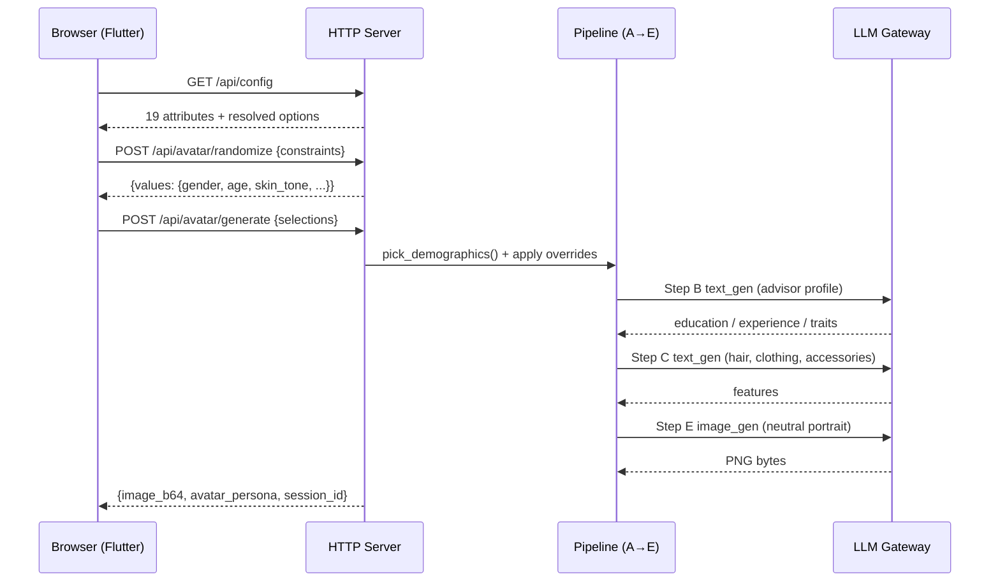
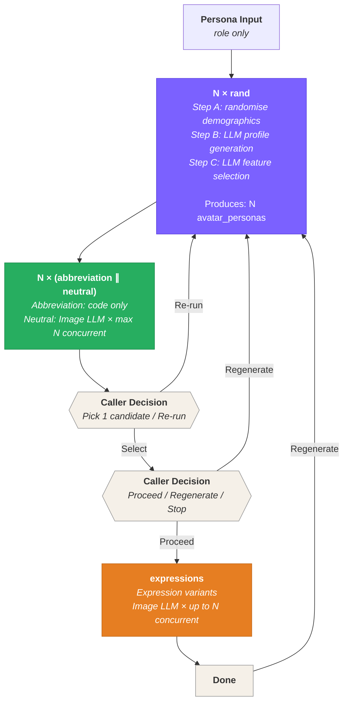

# Avatar Studio — Software Design

> Companion to the design spec: [avatars.md](../product/avatars.md).
> This document defines the **runtime architecture** — API services,
> concurrency, logging, file persistence, and error handling.

## Table of Contents

1. [Overview](#1-overview)
2. [API Services](#2-api-services)
3. [Artifact Dependency Flow](#3-artifact-dependency-flow)
4. [Logging & Observability](#4-logging--observability)
5. [Session File Structure](#5-session-file-structure)
6. [Error Handling](#6-error-handling)
7. [Dev Utilities (Classifiers)](#7-dev-utilities-classifiers)

---

## 1. Overview

Avatar Studio generates avatars through a multi-step pipeline that involves two LLM backends:

| Backend | Purpose | Typical latency |
|---------|---------|-----------------|
| **Text LLM** | Profile generation (Step B) + feature selection (Step C) — picks name, skin tone, hair, clothing, etc. | TBD (needs logging) |
| **Image LLM** | Portrait & expression generation (Steps E, F) — renders PNG images via the LLM Gateway | 10–60 s per image |

The API exposes stateless HTTP endpoints. Each endpoint performs a single, well-scoped operation and returns when done. There is no server-side session state for avatar generation — the caller owns the pipeline orchestration and artifact dependencies.

---

## 2. API Services

Two API layers exist side-by-side:

| Layer | Module | Purpose |
|-------|--------|---------|
| **HTTP server** | `api/http_server.py` | FastAPI on port 8080 — drives the Flutter web UI |
| **CLI backend** | `api/server.py` | `process_advisor()` used by the `avatar-studio` CLI |

### 2.1 HTTP Server Endpoints (`api/http_server.py`)

#### `GET /health`

Liveness check.

**Response:** `{"status": "ok"}`

---

#### `GET /api/config`

Returns all attribute definitions used to build the UI dynamically. Reads `assets/persona/attributes.yml` and resolves each `source:` reference into a typed option list. Fast — no LLM call.

**Response (abbreviated):**
```json
{
  "attributes": [
    {
      "id": "gender",
      "label": "Gender",
      "category": "demographics",
      "type": "choice",
      "selection_modes": [{"id": "random", "label": "Random"}, {"id": "select", "label": "Select"}],
      "default_mode": "random",
      "options": [{"id": "male", "label": "Male"}, ...]
    },
    {
      "id": "hair_color",
      "type": "dual_color",
      "field_names": ["hex_base", "hex_shadow"],
      "options": [{"id": "#3B2314 #261508", "extra": {"hex_base": "#3B2314", "hex_shadow": "#261508"}}, ...]
    },
    ...
  ]
}
```

---

#### `POST /api/avatar/randomize`

Runs Step A (`pick_demographics`) and applies any fixed constraints. Returns resolved attribute values without calling any LLM.

**Request:**
```json
{
  "constraints": [{"id": "gender", "mode": "select", "value": "female"}],
  "seed": null
}
```

**Response:**
```json
{
  "values": {
    "gender": "female",
    "age": 34,
    "skin_tone": "#E8C49A",
    "hair_color": "#D4A055 #B8873F",
    "brows_color": "#946F3A",
    "eye_shape": "almond",
    ...
  }
}
```

---

#### `POST /api/avatar/generate`

Runs the full pipeline (Steps A→B→C→E, neutral portrait only for MVP) in a thread executor. Returns a base64 PNG plus the full `avatar_persona` dict.

**Request:**
```json
{
  "selections": [{"id": "gender", "mode": "select", "value": "female"}],
  "expressions": ["neutral"],
  "width": 256,
  "height": 256,
  "seed": null
}
```

**Response:**
```json
{
  "image_b64": "<base64 PNG>",
  "avatar_persona": {"personal": {...}, "advisor": {...}, "appearance": {...}},
  "expressions": {"neutral": "<base64 PNG>"},
  "session_id": "uuid"
}
```

---

#### `WS /api/ws/keepalive`

Browser presence channel. Each Flutter tab connects here on startup and holds the connection open (server sends a `"ping"` every 15 s). When `AVATAR_BROWSER_SHUTDOWN=1`, the server self-terminates 8 s after the last connection drops.

---

### 2.2 Sequence Diagram (HTTP Server)



---

### 2.3 Old CLI Endpoints (`api/server.py`)

`process_advisor()` is the end-to-end function used by the `avatar-studio generate` CLI command. See `docs/software/architecture.md §7` for CLI sub-commands.

---

## 3. Artifact Dependency Flow

The pipeline produces five artifact types. The caller uses this dependency
graph to decide what can run, what must wait, and what requires a decision
before proceeding.



### Dependency Rules

| Artifact | Depends on | Can run in parallel with |
|----------|-----------|------------------------|
| **rand** (Steps A+B+C) × N | persona input (role) | each other (all N in parallel) |
| **abbreviation** (Step D) × N | rand (needs NAME) | neutral for same candidate |
| **neutral** portrait (Step E) × N | rand (needs avatar_persona) | abbreviation; other candidates (up to N) |
| **candidate selection** | all N candidates complete | — |
| **expressions** (Step F) | candidate selected + neutral portrait available | each other (up to N) |

### Concurrency

The backend publishes `max_concurrent_requests` via `GET /api/avatar/config`.
The caller is responsible for maintaining a request queue and never exceeding N
in-flight image requests. During the expression phase, up to N expressions are
generated concurrently; as one completes, the next is dequeued.

---

## 4. Logging & Observability

Every pipeline step is logged with structured fields. Logs go to stdout
(standard Python logging) and are also written as a `session.log` file inside
each image's folder (see §5).

### Log format

Logs use a timestamped `[Step X] START/DONE` format. The Python logging format
string is `"%(asctime)s.%(msecs)03d %(levelname)s %(message)s"` with
`datefmt="%Y-%m-%d %H:%M:%S"`.

**Example output:**
```
2026-03-25 14:32:01.123 INFO [Step A] START — randomise_person (seed=42)
2026-03-25 14:32:01.145 INFO [Step A] DONE  — gender=male, age=52, skin_tone=#5C3010
2026-03-25 14:32:01.150 INFO [Step B] START — generate_cv (model=ollama/qwen2.5:7b)
2026-03-25 14:32:03.890 INFO [Step B] DONE  — role=CEO, traits=3
2026-03-25 14:32:03.895 INFO [Step C] START — select_features (model=ollama/qwen2.5:7b)
2026-03-25 14:32:12.456 INFO [Step C] DONE  — 12 features selected, persona.yml written
2026-03-25 14:32:12.460 INFO [Step D] START — make_abbreviation (name=Marcus Washington)
2026-03-25 14:32:12.512 INFO [Step D] DONE  — /tmp/.../abbreviation.png
2026-03-25 14:32:12.515 INFO [Step E] START — generate_portrait neutral (model=x/flux2-klein:4b, style=clay)
2026-03-25 14:32:12.516 INFO [Step E] Writing session artifacts to /tmp/.../neutral/
2026-03-25 14:32:45.789 INFO [Step E] DONE  — /tmp/.../neutral/output.png
2026-03-25 14:32:45.800 INFO [Step F] START — generate_expression happy (ref=neutral/output.png)
2026-03-25 14:32:45.801 INFO [Step F] Writing session artifacts to /tmp/.../happy/
2026-03-25 14:33:18.234 INFO [Step F] DONE  — /tmp/.../happy/output.png
2026-03-25 14:33:18.240 INFO [Step G] START — postprocess circle_frame
2026-03-25 14:33:18.345 INFO [Step G] DONE  — /tmp/.../final.png
```

### Dual output

Each image generation writes logs to two destinations simultaneously:
- **Console** (`StreamHandler`) — standard stdout output
- **File** (`FileHandler`) — `session.log` inside the image's folder (e.g., `neutral/session.log`, `happy/session.log`)

### What gets logged

| Event | Log level | Details |
|-------|-----------|---------|
| Step START | INFO | step letter, function name, key parameters |
| Step DONE | INFO | step letter, key output values |
| Session artifacts written | INFO | folder path |
| Image saved to disk | INFO | file path, size bytes |
| Error | ERROR | full exception with traceback |

### Timing

The pipeline records wall-clock time for every step:
- **Profile generation**: text LLM call (Step B)
- **Feature selection**: text LLM call (Step C)
- **Image generation**: image LLM call per image (Steps E, F)
- **Abbreviation**: expected <100ms, no LLM (Step D)

Timing is returned in every response (`duration_ms`) and written to the session log file.

---

## 5. Session File Structure

Every avatar generation run writes artifacts and logs to a local directory
organised by persona name and run timestamp:

```
/tmp/avatar_studio/{persona_name}/{YYYYMMDD_HHMMSS}/
  persona.yml                       ← written by step C (shared for all expressions)
  neutral/
    style.yml
    expression.yml
    style_example_{gender}.png
    prompt.txt
    output.png
    session.log
  happy/
    style.yml
    expression.yml
    style_example_{gender}.png
    reference_person.png             ← step F only (copy of neutral/output.png)
    prompt.txt
    output.png
    session.log
  thinking/
    ...                              ← one subfolder per expression
```

### Files per image folder

| File | Written at | Content |
|------|-----------|---------|
| `persona.yml` | Before calling image model (step C output) | Full `avatar_persona` dict as YAML |
| `style.yml` | Before calling image model | Extracted style entry from `styles.yml` for the selected `style_id` |
| `expression.yml` | Before calling image model | Extracted expression entry from `expressions.yml` for the target expression |
| `style_example_{gender}.png` | Before calling image model | Copy of the style's example image from `assets/styles/` |
| `reference_person.png` | Before step F (expression variants only) | Copy of `neutral/output.png` used as identity anchor |
| `prompt.txt` | Before calling image model | The combined prompt sent to the image model |
| `output.png` | After image model returns | The generated image |
| `session.log` | Throughout the generation | Timestamped `[Step X] START/DONE` log for this image |

### Lifecycle

- A new timestamped folder is created on each generation run — no run ever overwrites another
- Files are written as they are produced (portrait first, then expressions)
- Directories are **not** auto-cleaned — the caller or a cron job removes old sessions

---

## 6. Error Handling

### Per-step error behavior

| Step | On failure | Caller handling |
|------|-----------|-----------------|
| **config** | Returns HTTP error | Caller retries or aborts |
| **rand** (features) | Returns HTTP error | Caller retries or aborts |
| **abbreviation** | Logs warning, may return partial result | Non-blocking — caller continues without abbreviation |
| **neutral** (portrait) | Returns HTTP error | Caller may retry with same `avatar_persona` |
| **expression** (one) | Returns HTTP error for that expression | Caller may retry individually; other expressions unaffected |
| **expression** (all fail) | Each returns HTTP error | Caller may retry all or accept portrait only |

### Retry semantics

- **Retry** re-runs only the failed step with the same `avatar_persona` — no need to regenerate features or portrait
- **Regenerate** means the caller discards all artifacts and starts from scratch (new rand, new persona, new images)
- Abbreviation failure is non-fatal — the caller proceeds without it

### Timeout

- Each image request has a configurable timeout (default: 120s)
- If the LLM Gateway doesn't respond within the timeout, the request returns an error
- The caller handles the timeout and decides whether to retry

### Cancellation

- The caller cancels in-flight requests by aborting the HTTP connection
- The backend has no cancel API — if a gateway call is in progress, it runs to completion server-side but the response is discarded

---

## 7. Dev Utilities (Classifiers)

The `src/avatar_studio/tuning/` package includes utilities for evaluating
and iterating on generated images. These are not part of the production pipeline
— they are used during style development and prompt tuning.

### `classify_style.py`

Answers: **"Which art style is this image?"**

Takes a generated PNG and scores it against the known style IDs (clay, emoji,
lineart, etc.). Returns a ranked list of style IDs with confidence scores, with
the best match first. Used to verify that a generated image actually matches the
intended `style_id`.

### `classify_persona.py`

Answers: **"Do the visual properties of this image match the persona?"**

Takes a generated PNG and an `avatar_persona` dict, then checks each visual
property (hair colour, skin tone, clothing colour, glasses, etc.) against the
persona spec. Returns a scored pass/fail result per property, making it easy to
identify which attributes the image model missed or misrendered.

### `classify_expression.py`

Answers: **"Does the expression in this image match the target?"**

Takes a generated PNG and a target expression ID (e.g., `happy`, `neutral`,
`thinking`). Verifies the facial expression by checking FACS action units
against the expected expression. Returns a pass/fail verdict with per-unit
detail, so prompt failures can be diagnosed precisely.

### `style_tuner.py`

Runs a **generate → classify → report** loop for iterating style prompts.

Given a style ID and a set of test personas, it generates images with the
current style prompt, runs all three classifiers (style, persona, expression),
and writes a structured report. Session artifacts are written to
`/tmp/avatar_studio/style_tuner/{YYYYMMDD_HHMMSS}/{style_id}_{persona_id}/`
following the same folder hierarchy as the main pipeline (§5), including
`persona.yml`, `style.yml`, `expression.yml`, `reference_person.png`,
`prompt.txt`, `output.png`, and `session.log`.

### `expression_tuner.py`

Runs a **generate → classify → report** loop for iterating expression prompts
(FACS labels and descriptions in `assets/expressions/expressions.yml`).

#### Image generation parameters

| Flag | Default | Notes |
|---|---|---|
| `--width` / `--height` | 256 | Passed to gateway `image_gen`; honours flexible resolution (64–2048) |
| `--optimize` | `normal` | `fast` halves generation time (~12s vs ~27s) with acceptable quality loss for tuning; `quality` for final evaluation |

**Recommended tuning settings** (latency-first):

```bash
.venv/bin/avatar-expression-tuner \
  --expression all --style photorealistic \
  --gender all --runs 3 \
  --width 256 --height 256 --optimize fast
```

#### Style benchmark (2026-04-03)

Full 75-image run (5 expressions × 5 styles × 3 genders × 1 run):

| Style | Pass rate | Avg gen time |
|---|---|---|
| **photorealistic** | **60%** | **25s** |
| lineart | 60% | 30s |
| clay | 40% | 29s |
| studio_3d | 33% | 27s |
| korean | 0% | 26s |

**Decision**: `photorealistic` is the canonical style for expression tuning — best pass rate
and fastest generation time. Korean style is excluded from tuning runs because the flat
rendering suppresses all emotional cues (0% pass, structural).

#### Parallel image generation

The tuner submits all images for a given `(expression × style × genders × runs)` batch
to a `ThreadPoolExecutor(max_workers=3)`, matching the gateway's `parallel.ollama = 3`
setting in `llm_gateway/settings.json`. Classification remains sequential after all images
in the batch are collected.

> **Note**: Ollama processes GPU work serially regardless of concurrent HTTP requests —
> parallelism here improves throughput only when a truly parallel backend
> (multiple Ollama instances or a hosted API) is used. The code is ready for that.
