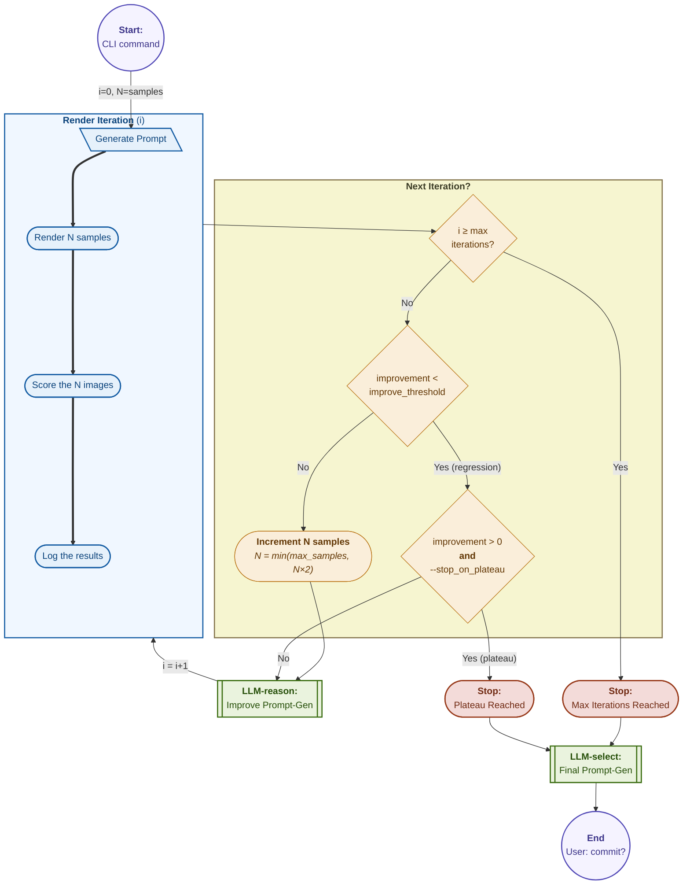
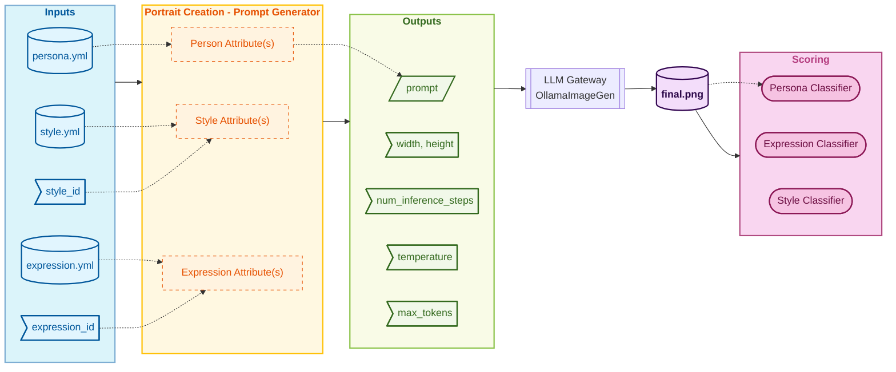
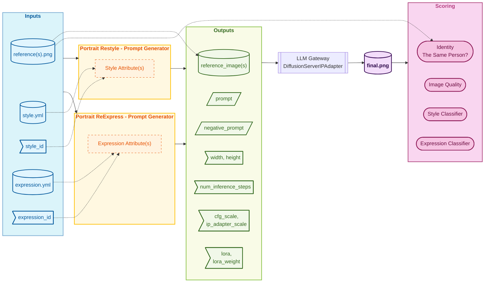

# Prompt-Generation Learning Scripts

Learning scripts measure and improve pipeline quality through iterative benchmarking and LLM-driven fixes.

## Folder structure

```
scripts/learn/          — learning scripts + shared libraries
scripts/examples/       — example dataset management
scripts/              — infrastructure only (install, run, test, stop)
logs/learn/           — experiment logs (.ljson, never deleted, untracked)
reports/              — benchmark JSON outputs (untracked)
```

## Three pipelines, three scripts

| Script | Pipeline | Renders via | Scores |
|---|---|---|---|
| `learn_create.py` | Persona → avatar | `image_gen` | persona + style + SBS |
| `learn_restyle.py` | Avatar → new style | `ipadapter_faceid` | style + identity (SBS) |
| `learn_reexpress.py` | Avatar → new expression | `ipadapter_faceid` | expression + identity (SBS) |

## Common CLI signature

All three scripts share the same flags:

```
--range A B               inclusive index range into sorted example list
--samples X               random sample count (mutually exclusive with --range)
--workers N               parallel render workers (default: 3)
--stop-on-plateau         stop when score delta < 1% for 2 consecutive iterations
--no-stop-on-plateau      disable plateau guard
--max-iterations N        maximum number of learning iterations (if platue not reached or disabled)
--optimize OPT            rendering optimisation: quality | normal | fast  
--improve-threshold F     min score delta (0.0–1.0) between iterations to be
                          considered meaningful progress; below this triggers
                          the plateau exit-ramp
--component-threshold S   min score (0.0–1.0) for each individual score component
--compound-threshold S    min score (0.0–1.0) for compound/aggregate scores
--gateway URL             LLM gateway base URL
--log-dir DIR             experiment log directory
--from-source PATH        source file, relative to each example's folder
```

### parameter defaults per script

| Parameter | Script | Default | Notes |
|---|---|---| --- |
|`--samples`| Any | Entire set | prompt confiramtion if samples > 100 |
|`--workers`| Any | 3 | |
|`--max-iterations`| Any | 2 | | 
|`--stop-on-plateau`| Any | true | |
|`--optimize` | Any | `normal` | |
|`--improve-threshold` | Any | `0.03` | 3% delta minimum |
|`--component-threshold` | Any | `0.75` | |
|`--compound-threshold` | Any | `0.90` | |
|`--gateway`| Any | `localhost:4096` ||
|`--log-dir`| Any | `logs/learn/` ||
|`--from-source`| `learn_create.py` | `persona.yml` | Persona YAML used as generation input |
| | `learn_restyle.py`[^source_img] | `images/photorealistic.png` | Must resolve to an image |
| | `learn_reexpress.py`[^source_img] | `images/photorealistic.png` | Must resolve to an image |

> All scores are in the range 0.0–1.0. Threshold flags use the same scale (e.g. `0.75`, not `75`).

**Example — use the real downloaded portrait as the IPAdapter identity source:**

```bash
python scripts/learn/learn_create.py    --samples 20 --from-source persona.yml
python scripts/learn/learn_reexpress.py --samples 32 --max-iterations 6 --from-source images/best.jpg
python scripts/learn/learn_restyle.py   --samples 20 --from-source images/best.jpg
```

## Iterative Sampling Strategy




**Step 0**: Choose N samples (`--samples`, `--range` or default); i=0

**Render Iteration (i)**: Use Prompt-gen to: `Prompt`, `Render`, `Score`, `Log` the N samples.

**Iteration Decision tree**:
(1) Good improvement → grow (up to double) N samples → reason → reiterate
(2) Negative improvement → keep N samples → reason → reiterate
(3) Tiny improvement → Plateau exit-ramp, or:→ keep N samples → reason → reiterate

Stop conditions:
1. reached max_n_iterations (normal)
2. reached plateau (and `--stop_on_plateau` is `true`)

**Step N** (N ≥ 1): Keep ALL examples from step N-1 (regression testing) + add up to N fresh examples.
Render with modified pipeline. Score and compare.

### Reason - LLM Prompt-Gen Improvement

> **Improve LLM Reason**: explores new solutions — higher temperature, generative. The LLM proposes changes to the Prompt-Generator given the current failure patterns.
> **Final LLM Selection**: selects the best solution from those already produced — lower temperature, deterministic. Does not generate new candidates; consolidates into the final Prompt-Generator.

The Portrait-Prompt-Generators are script with known inputs and outputs (see below script)
The Reasoning-LLM task is to create the $\color{#e65100}{\text{Prompt-Generator}}$ code.

### Create Portrait Flow

Create Portrait Flow is based on $\color{#01579b}{\textsf{style}}$, $\color{#01579b}{\textsf{expression}}$ and $\color{#01579b}{\textsf{persona}}$ literals and renders via LLM-Gateway's $\color{#440B72}{\textsf{OllamaImageGenLLM}}$

The scores it is trying to maximize [are](../pipeline/create_from_persona.md#4-validation):

| Scorer | Signal | Weight | Role in this flow |
|---|---|---|---|
| Persona Categorizer | Phenotype fidelity | 🌕🌕🌕 |Verifies the output reflects the persona attributes that were used to generate it |
| Style Classifier | Style fidelity | 🌕🌗🌚| Verifies the output matches the requested `style_id` |
| Expression Classifier | Expression accuracy | 🌕🌚🌚| Verifies the rendered expression matches the requested `expression_id` |



### ReStyle / ReExpress Portrait Flows

ReStyle / ReExpress Portrait Flows are based on $\color{#01579b}{\textsf{reference image(s)}}$, $\color{#01579b}{\textsf{style}}$ and $\color{#01579b}{\textsf{expression}}$ literals and renders via LLM-Gateway's $\color{#440B72}{\textsf{DiffusionServerIPAdapterLLM}}$

The scores it is trying to maximize are [restyle](../pipeline/create_from_persona.md#4-validation) / [ReExpress](../pipeline/expressions_from_image.md#4-validation):

| Scorer | Signal | **ReStyle** Weights | **ReExpress** Weights |
|---|---|---|---|
| Side-by-Side Comparison (`identity_score`) | Likeness to source images | 🌕🌕🌕 primary | 🌕🌕🌕 primary |
| Final product (`quality_score`) | Render quality | 🌕🌕🌚 important| 🌕🌕🌚 important|
| Style Classifier | Target style fidelity | 🌕🌕🌗 target| 🌕🌚🌚 secondary|
| Expression Classifier | Expression accuracy | 🌕🌚🌚 secondary| 🌕🌕🌗 target|
| Persona Categorizer | Attribute match vs extracted spec | 🌗🌚🌚 tiebreaker | 🌗🌚🌚 tiebreaker |




## Experiment logs (.ljson)

Each run writes one JSON object per line to `logs/learn/<script>_<timestamp>.ljson`:

```json
{"ts": "...", "type": "config", "script": "learn_create", "samples": 20}
{"ts": "...", "type": "render", "iteration": 0, "example": "adele", "style": "photorealistic"}
{"ts": "...", "type": "score", "iteration": 0, "example": "adele", "persona_score": 0.85}
{"ts": "...", "type": "fix", "iteration": 0, "description": "phenotype.skin_tone: +2 values"}
{"ts": "...", "type": "summary", "iteration": 0, "avg_persona": 0.82}
{"ts": "...", "type": "done", "reason": "plateau"}
```

Logs are append-only and never deleted. Use them for debugging and historical tracking.

## When to run each script

| Situation | Script |
|---|---|
| Persona accuracy regressed / improving prompts | `learn_create.py` |
| Styles look wrong after model update | `learn_restyle.py` |
| Expressions not rendering correctly | `learn_reexpress.py` |

## Quick start

```bash
# Quick test (5 examples, 1 iteration, fast mode)
python scripts/learn/learn_create.py --samples 5 --max-iterations 1 --optimize fast
python scripts/learn/learn_restyle.py --samples 5 --max-iterations 1 --optimize fast
python scripts/learn/learn_reexpress.py --samples 5 --max-iterations 1 --optimize fast

# Standard improvement run
python scripts/learn/learn_create.py --samples 30 --style photorealistic
python scripts/learn/learn_restyle.py --samples 32 --max-iterations 6 --optimize quality --style photorealistic
python scripts/learn/learn_reexpress.py --range 0 127 --style studio_3d --from_source=images/photorealistic.png

```

[^source_img]: > **Notes**: 
**Format conversion**: `learn_restyle.py` and `learn_reexpress.py` pass the source image directly to
`ipadapter_faceid`, which requires PNG bytes. If `--from-source` resolves to a non-PNG file (e.g.
`images/best.jpg`), the image is decoded and re-encoded as PNG in memory before being sent — no file
is written to disk.
**Exclusion rule**: if `<example_dir>/<from-source>` does not exist, that example is silently dropped
from the candidate pool before sampling. This keeps the effective pool consistent with the actual
available data, rather than producing runtime errors mid-run.