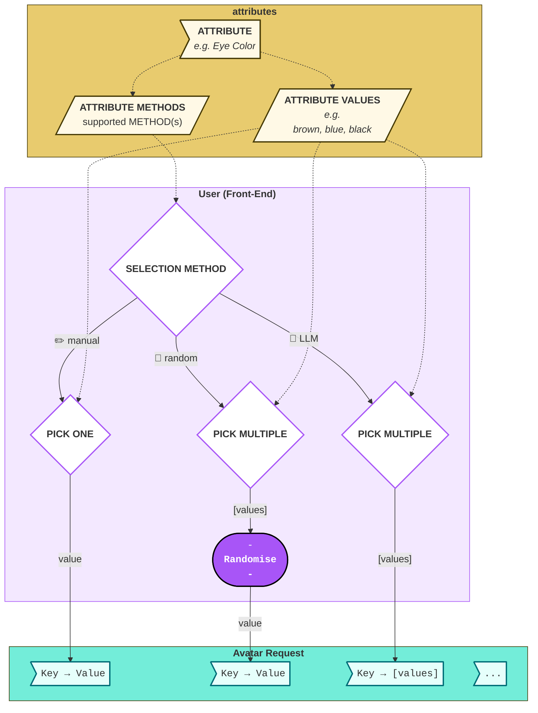
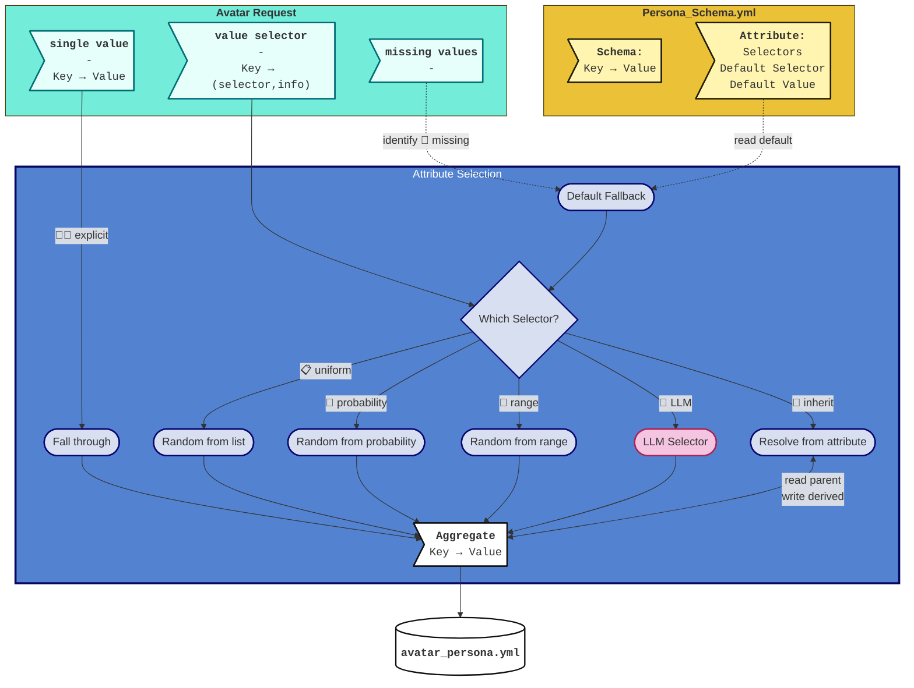
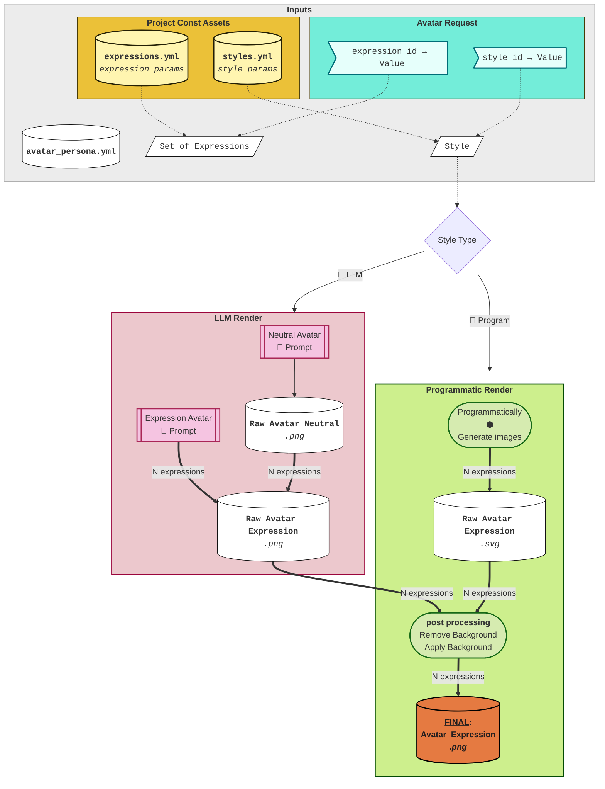

# Pipeline: Create Avatar from Persona Spec

**Input**: Avatar Request (persona spec + rendering parameters)
**Output**: Set of PNGs — one per expression — each depicting the same person

---

## 1. Input

### Rendering Parameters

| Parameter | Description |
|---|---|
| **Artistic Style** | Which visual style to render — any `style_id` from `assets/styles/styles.yml` (e.g. `studio_3d`, `photorealistic`) |
| **Expression IDs** | Which expression(s) to generate: single name, list, `"all"`, or `"random"` (pick one) |
| **Image Size** | Output pixel dimensions (width × height) |
| **Background Style** | How to composite the background: `transparent`, `color-fill`, or `round-fill` |
| **Background Color** | Hex color used for the background element |

Expression IDs are requested together in a single call so that all expression variants are recognisably the same person.

For the full Avatar Request data structure and selector types see [common/structures.md](../common/structures.md#avatar-request).

### API and Frontend Users

The library is primarily used as an API or package. The Avatar Request arrives as a file or via HTTP API.

The minimal frontend allows per-attribute selection using ✏️ Manual, 🎲 Random, or 🤖 LLM pick methods:

---

## 2. Output

A **set of PNGs**, each representing the same person in a distinct facial expression.

Every PNG carries embedded metadata. For the full metadata schema see [common/structures.md](../common/structures.md#png-metadata).

---

## 3. Pipeline

### 3.1 Generate Avatar Persona

**Input**: Avatar Request
**Output**: Avatar Persona (`avatar_persona.yml`) — see [common/structures.md](../common/structures.md#avatar-persona)

The persona generation phase resolves all avatar attributes from the Avatar Request into concrete values. The resulting Avatar Persona is the single source of truth consumed by the rendering steps.

#### 3.1.1 Flowchart

#### 3.1.2 Order of Attribute Resolving

1. **Missing 🫥** — pre-pass assigns schema default (selector/value) for any missing attribute
2. **Single Value ☝🏻** — explicit values pass through unchanged (*e.g. `Eye Color: Green`*)
3. **Random Selectors** (📋 uniform, 🎲 probability, 🎯 range) (*e.g. `Age: range(25, 70)`*)
4. **LLM 🤖** — may implicitly depend on already-resolved attributes (*e.g. `Brows Color` may inherit from `Age`, `Hair Color`*)
5. **Inherited 🔗** — value derived from another attribute (*e.g. `First Name` is a list pick derived from `Gender`*)

> Note: Inherited attributes cannot depend on other inherited attributes — evaluation order is undefined.

The result is a fully concrete Avatar Persona — every attribute has exactly one resolved value. No selectors remain.

#### 3.1.3 Multiple-Selection Types

| Type | Description |
|---|---|
| 📋 Uniform random pick | From a list of values |
| 🎯 Uniform random pick | From a range (integer / color) |
| 🎲 Probability random pick | Dict of `{value: probability}` (probabilities must sum to 1) |
| 🤖 LLM pick | LLM receives all attributes resolved so far and a schema-restricted output format |

#### 3.1.4 Unit-level Breakdown

- [avatar_persona_generator](../pipeline/persona/avatar_persona_generator.md)
  - [avatar_persona_schema](../pipeline/persona/avatar_persona_schema.md)
  - [avatar_request_serve](../pipeline/api/avatar_request_serve.md)
    - [avatar_request_api](../pipeline/api/avatar_request_api.md)
    - [avatar_request_validate_input](../pipeline/api/avatar_request_validate_input.md)
    - [avatar_request_identify_missing](../pipeline/api/avatar_request_identify_missing.md)
      - [avatar_persona_default_fallback](../pipeline/persona/avatar_persona_default_fallback.md)
    - [avatar_request_identify_explicits](../pipeline/api/avatar_request_identify_explicits.md)
      - [avatar_persona_aggregator_fallthrough](../pipeline/persona/avatar_persona_aggregator_fallthrough.md)
    - [avatar_request_parse_selector](../pipeline/api/avatar_request_parse_selector.md)
      - [avatar_persona_aggregator_random_from_list](../pipeline/persona/avatar_persona_aggregator_random_from_list.md)
      - [avatar_persona_aggregator_random_from_range](../pipeline/persona/avatar_persona_aggregator_random_from_range.md)
        - [avatar_persona_aggregator_random_from_range_color](../pipeline/persona/avatar_persona_aggregator_random_from_range_color.md)
      - [avatar_persona_aggregator_random_from_probability](../pipeline/persona/avatar_persona_aggregator_random_from_probability.md)
      - [avatar_persona_aggregator_from_llm](../pipeline/persona/avatar_persona_aggregator_from_llm.md)
      - [avatar_persona_aggregator_from_inherited](../pipeline/persona/avatar_persona_aggregator_from_inherited.md)
    - [avatar_persona_marshal](../pipeline/persona/avatar_persona_marshal.md)

#### 3.1.5 Testability

The whole unit is unit-testable, except for LLM generation. LLM generation mock would be random — unnecessary to test; mark as intentionally skipped (low ROI).

---

### 3.2 Render Avatars

**Input**: Avatar Persona (`avatar_persona.yml`)
**Output**: Avatar Images — final PNGs per expression

#### 3.2.1 Flowchart

#### 3.2.2 Render Sequence

1. **Style resolution** — `style_id` is looked up in `styles.yml`; determines render family (LLM or Programmatic) and loads the style directive or component configuration.
2. **Expression set resolution** — `expression_id` is resolved to a concrete list of names: single name, explicit list, `"all"` (every expression in `expressions.yml`), or `"random"` (one uniform pick).
3. **Path branch on style family** — LLM styles → LLM render; Programmatic styles → Programmatic render.
4. **(🤖) LLM — Neutral Portrait** · [SRS →](../pipeline/render/avatar_render_llm_neutral_portrait.md) — one image model call; establishes visual identity. Prompt combines the style directive, a sanitized persona YAML, and the neutral expression.[^persona-sanitize] Output PNG is the reference image for all expression variants.
5. **(🤖) LLM — Expression Variants** · [SRS →](../pipeline/render/avatar_render_llm_expression_variants.md) — N calls (one per non-neutral expression), each receiving the neutral portrait as a reference image to anchor identity.[^ref-img-f] Individual failures are non-fatal.
6. **(🐍) Programmatic — Expression Set** · [SRS →](../pipeline/render/avatar_render_programmatic.md) — N SVG generations via DiceBear (Node.js), seeded deterministically from the persona name. Expression controlled by pre-mapped component overrides — no neutral reference needed. Failure is non-fatal.
7. **(🐍) Post-processing SVG→PNG** — SVG rasterized to PNG.
8. **Post-processing** · [SRS →](../pipeline/render/avatar_postprocessor.md) — applied to outputs from both paths: background removal (LLM path only) then composite layout.[^no-bg-in-style]

[^persona-sanitize]: Text-heavy fields (name, CV, traits) are excluded from the image prompt — the model may render them as literal text. `eye_shape` is excluded because rendering is owned by the style system prompt; persona-level eye shape would conflict.
[^ref-img-f]: Without the reference image the model generates a different-looking person for each expression. The reference anchors hair, skin, and facial structure while allowing the expression signal to vary.
[^no-bg-in-style]: Style system prompts deliberately omit background instructions. A background in the raw output would conflict with background removal in post-processing, producing a doubled or inconsistent result in the final composite.

#### 3.2.3 Render Families

| | **🤖 LLM** | **🐍 Programmatic** |
|---|---|---|
| Driven by | Image model + style system prompt | DiceBear component library (Node.js) |
| Raw output format | PNG | SVG |
| Expression control | FACS codes + description in prompt | Pre-mapped component variants (eyes, mouth, brows) |
| Identity anchor | Neutral portrait passed as reference image | Name seed — same name always produces same avatar |
| Deterministic | No | Yes (except `opeeps` style) |
| Persona applied | Full visual persona YAML | `bg_color` only |
| Failure granularity | Per-expression (one failure doesn't block others) | Whole path (Node.js unavailable → no programmatic output) |

#### 3.2.4 Unit-level Breakdown

- [avatar_renderer](../pipeline/render/avatar_renderer.md)
  - [avatar_render_style_resolver](../pipeline/render/avatar_render_style_resolver.md)
  - [avatar_render_expression_resolver](../pipeline/render/avatar_render_expression_resolver.md)
  - [avatar_render_llm](../pipeline/render/avatar_render_llm.md)
    - [avatar_render_llm_prompt_builder](../pipeline/render/avatar_render_llm_prompt_builder.md)
      - [avatar_render_llm_persona_sanitizer](../pipeline/render/avatar_render_llm_persona_sanitizer.md)
      - [avatar_render_llm_style_directive](../pipeline/render/avatar_render_llm_style_directive.md)
      - [avatar_render_llm_facs_resolver](../pipeline/render/avatar_render_llm_facs_resolver.md)
    - [avatar_render_llm_neutral_portrait](../pipeline/render/avatar_render_llm_neutral_portrait.md)
    - [avatar_render_llm_expression_variants](../pipeline/render/avatar_render_llm_expression_variants.md)
  - [avatar_render_programmatic](../pipeline/render/avatar_render_programmatic.md)
    - [avatar_render_programmatic_expression_mapper](../pipeline/render/avatar_render_programmatic_expression_mapper.md)
    - [avatar_render_programmatic_svg_generator](../pipeline/render/avatar_render_programmatic_svg_generator.md)
  - [avatar_postprocessor](../pipeline/render/avatar_postprocessor.md)
    - [avatar_postprocessor_svg_2_png](../pipeline/render/avatar_postprocessor_svg_2_png.md)
    - [avatar_postprocessor_background_remover](../pipeline/render/avatar_postprocessor_background_remover.md)
    - [avatar_postprocessor_compositor](../pipeline/render/avatar_postprocessor_compositor.md)
      - [avatar_postprocessor_metadata](../pipeline/render/avatar_postprocessor_metadata.md)

#### 3.2.5 Testability

- `avatar_render_style_resolver`, `avatar_render_expression_resolver` — pure lookups, fully unit-testable.
- `avatar_render_llm_prompt_builder` and children (`persona_sanitizer`, `style_directive`, `facs_resolver`) — pure functions, fully unit-testable.
- `avatar_render_llm_neutral_portrait`, `avatar_render_llm_expression_variants` — image model calls; integration-test only, mock at gateway boundary.
- `avatar_render_programmatic_svg_generator` — Node.js subprocess; integration-test only, mock at subprocess boundary or use a fixture SVG.
- `avatar_postprocessor_background_remover` — depends on rembg ONNX model; integration-test, can be mocked with a pre-removed fixture image.
- `avatar_postprocessor_compositor` — pure Pillow, fully unit-testable with fixture images.

---

## 4. Validation

Three scorers run independently on each final PNG. Scores are written to the `acceptance-scores` field in the output metadata. They are informational — the library returns them; the caller decides what to do (retry, warn, reject).

For scorer specifications see [common/validation.md](../common/validation.md).

| Scorer | Signal | Role in this flow |
|---|---|---|
| Expression Classifier | Expression accuracy | Verifies the rendered expression matches the requested `expression_id` |
| Style Classifier | Style fidelity | Verifies the output matches the requested `style_id` |
| Persona Categorizer | Phenotype fidelity | Verifies the output reflects the persona attributes that were used to generate it |
| Side-by-Side Comparison | Identity consistency | Not used — there is no prior reference image |
