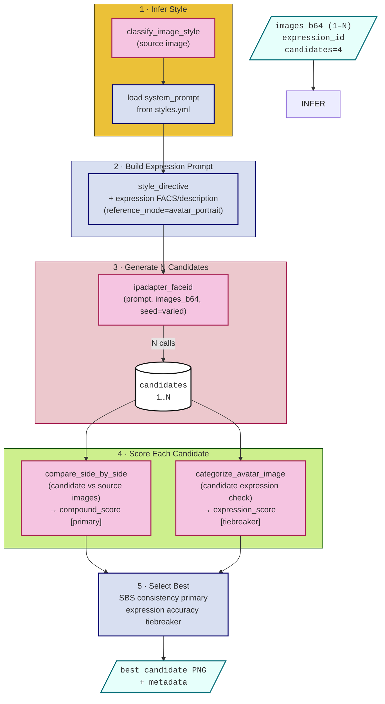

# Pipeline: Change Expression from Image

**Input**: 1–N images of the same avatar (any expression) + target expression
**Output**: Single best-candidate PNG — same identity and style, new expression

---

## 1. Input

| Parameter | Type | Description |
|---|---|---|
| `images_b64` | `list[str]` | 1–N images of the same avatar in base64; any expression |
| `expression_id` | `str` | Target expression — any expression name from `assets/expressions/expressions.yml` |
| `candidates` | `int` (default 4) | Number of candidates to generate and score |
| `width` | `int` (default 512) | Output image width in pixels |
| `height` | `int` (default 512) | Output image height in pixels |

The source images are the complete specification — they encode identity, style, and presentation. No persona extraction is needed; only the expression is free to change.

Multiple source images are supported. When N > 1, they collectively anchor the identity and style more strongly via IP-Adapter.

---

## 2. Output

A single PNG — the highest-scoring candidate — with embedded metadata. For the metadata schema see [common/structures.md](../common/structures.md#png-metadata).

---

## 3. Pipeline

### Step 1 — Infer Style

- `classify_image_style(source_image)` → `style_id`
- Load `system_prompt` for the inferred style from `assets/styles/styles.yml`
- This provides the style directive for the prompt without requiring the user to specify a style

### Step 2 — Build Expression Prompt

- Prompt contains: style directive (from inferred style) + expression FACS codes and description only
- No persona attributes — the source images carry identity; the prompt contributes only the expression signal
- `reference_mode="avatar_portrait"` — instructs the model to preserve every visual detail and change only the expression

### Step 3 — Generate N Candidates

- N calls to `GatewayClient.ipadapter_faceid(expression_prompt, images_b64, seed=varied)`
- All source images are passed together as identity and style anchors
- Seeds are varied across calls to produce diverse expression attempts

### Step 4 — Score Each Candidate

| Signal | Method | Role |
|---|---|---|
| SBS consistency | `compare_side_by_side(candidate, source)` | Primary — does the candidate remain visually consistent with the source? |
| Expression accuracy | `categorize_avatar_image(candidate)` expression property | Tiebreaker |

### Step 5 — Select Best

Rank candidates by SBS `compound_score`; use `expression_score` as tiebreaker. Return the highest-ranked candidate.

---

## 4. Validation

For scorer specifications see [common/validation.md](../common/validation.md).

| Scorer | Signal | Weight |
|---|---|---|
| Side-by-Side Comparison (`compound_score`) | Visual consistency with source | ●●●●● primary |
| Side-by-Side Comparison (`identity_score`) | Same-person confirmation | ●●●●○ |
| Expression Classifier | Expression accuracy | ●●●●● tiebreaker |
| Style Classifier | Style preservation | ●●●○○ |
| Persona Categorizer | Not used — no persona extracted | — |

**Consistency with the source image is the primary quality gate.** Drift from the source on any axis other than expression is the defining failure mode for this flow.
