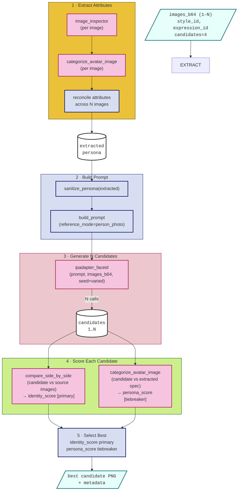

# Pipeline: Restyle Avatar from Image

**Input**: 1–N reference images of an existing avatar + target style + target expression
**Output**: Single best-candidate PNG — same identity, new style and expression

---

## 1. Input

| Parameter | Type | Description |
|---|---|---|
| `images_b64` | `list[str]` | 1–N reference images in base64; any style or origin |
| `style_id` | `str` | Target style — any `style_id` from `assets/styles/styles.yml` |
| `expression_id` | `str` | Target expression — any expression name from `assets/expressions/expressions.yml` |
| `candidates` | `int` (default 4) | Number of candidates to generate and score |
| `width` | `int` (default 512) | Output image width in pixels |
| `height` | `int` (default 512) | Output image height in pixels |

Multiple reference images are supported natively. When N > 1, attribute extraction and identity scoring run per image, then reconcile.

---

## 2. Output

A single PNG — the highest-scoring candidate — with embedded metadata. For the metadata schema see [common/structures.md](../common/structures.md#png-metadata).

---

## 3. Pipeline

### Step 1 — Extract Attributes

- Call `GatewayClient.image_inspector()` on each reference image
- Run `categorize_avatar_image()` to get a structured attributes dict per image (see [Persona Categorizer](../common/validation.md#persona-categorizer))
- Reconcile across N images: most consistent value per attribute wins

### Step 2 — Build Prompt

- `sanitize_persona(extracted)` strips text-heavy and compositing-only fields
- `build_prompt(reference_mode="person_photo")` — the `person_photo` mode instructs the model to anchor on the reference image appearance while applying the target style

### Step 3 — Generate N Candidates

- N calls to `GatewayClient.ipadapter_faceid(prompt, images_b64, seed=varied)`
- All reference images are passed together; IP-Adapter uses them collectively as the identity anchor
- Seeds are varied across calls to produce diverse candidates

### Step 4 — Score Each Candidate

| Signal | Method | Role |
|---|---|---|
| SBS identity | `compare_side_by_side(candidate, source)` | Primary — does the candidate look like the source? |
| Persona attribute match | `categorize_avatar_image(candidate)` vs extracted spec | Tiebreaker |

### Step 5 — Select Best

Rank candidates by `identity_score`; use `persona_score` as tiebreaker. Return the highest-ranked candidate.

---

## 4. Validation

For scorer specifications see [common/validation.md](../common/validation.md).

| Scorer | Signal | Weight |
|---|---|---|
| Side-by-Side Comparison (`identity_score`) | Likeness to source images | ●●●●● primary |
| Side-by-Side Comparison (`quality_score`) | Render quality | ●●●●○ |
| Style Classifier | Target style fidelity | ●●●●○ |
| Persona Categorizer | Attribute match vs extracted spec | ●○○○○ tiebreaker |
| Expression Classifier | Expression accuracy | ●●●○○ |

**Identity consistency is the primary quality gate.** Likeness across the style boundary is the defining success criterion for this flow.
