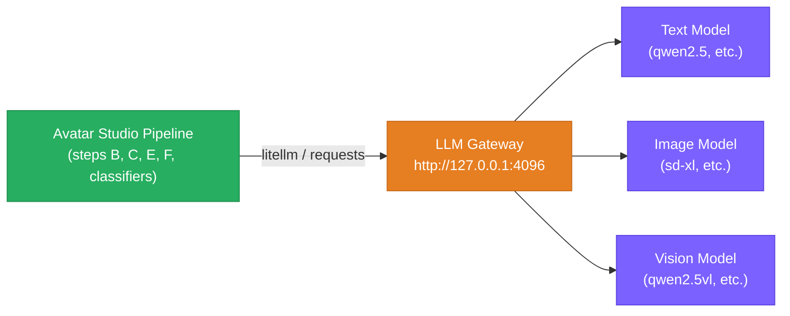
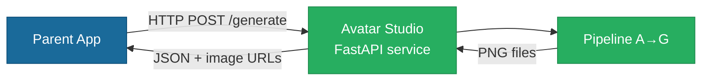

# Avatar Studio — SW Integrations Plan

**Project**: avatar-studio — standalone avatar generation package
**Date**: 2026-04-03
**Version**: 0.1.0

---

## 1. LLM Gateway Integration

### 1.1 Architecture

All LLM calls are routed through the LLM Gateway running at `http://127.0.0.1:4096`. Avatar Studio never calls model endpoints directly.



### 1.2 Model Configuration

Default models are configured in `assets/persona/cv_settings.json` and `assets/persona/presentation_settings.json`:

| Use | Setting key | Typical value |
|-----|-------------|---------------|
| Text generation (Steps B, C) | `default_text_gen_model` | `ollama/qwen2.5:7b` |
| Image generation (Steps E, F) | `default_image_gen_model` | `sd-xl:latest` |
| Vision / classification | `default_visual_desc_model` | `ollama/qwen2.5vl:7b` |

### 1.3 LiteLLM Routing

Text and vision calls use `litellm.completion()` with `api_base="http://127.0.0.1:4096"`.

Image generation uses `requests.post()` directly to `http://127.0.0.1:4096/api/generate`.

**Known issue — chunked-transfer header bug**: Ollama's `/api/show` returns a duplicate `Transfer-Encoding: chunked` header. Workaround: force `max_keepalive_connections=0` on litellm's internal HTTP clients (see `step_b_generate_cv.py`). Must be re-applied after any litellm client reset.

---

## 2. REST API Integration (Parent Apps)

### 2.1 Architecture

Parent applications (e.g. MyBoard) integrate with Avatar Studio via its FastAPI service.



### 2.2 Key Endpoint

| Endpoint | Method | Input | Output |
|----------|--------|-------|--------|
| `/generate` | POST | Advisor YAML (role, optional style) | JSON with paths to generated PNGs |

### 2.3 Startup

The CLI entry point (`avatar-studio`) launches uvicorn. Parent apps start Avatar Studio as a subprocess and communicate via `localhost:<port>`.

---

## 3. Package Dependency Integration

Avatar Studio can also be imported directly as a Python package:

```python
from avatar_studio.api.server import process_advisor

result = process_advisor(advisor_yaml_path="advisor.yml")
# result contains paths to generated PNG files
```

This is the recommended integration for tightly coupled parent applications that want to avoid subprocess overhead.

---

## 4. CI Integration

| Trigger | Workflow | What runs |
|---------|----------|-----------|
| Push / PR to `main` | `ci.yml` | Lint (ruff) + unit tests (`avatar and not integration`) |
| `OLLAMA_URL` var set | `ci.yml` integration job | Integration tests (`avatar and integration`) |
| Manual dispatch | `tuner.yml` | Expression Autotuner with configurable iterations and threshold |

Integration tests require a running LLM Gateway reachable at `$OLLAMA_URL`. Set the `OLLAMA_URL` repository variable to enable them.

---

## 5. Programmatic Avatar (PA) — Vendored Node Sub-project

### 5.1 Overview

Step D generates a Programmatic Avatar (PA) SVG in addition to the initials abbreviation PNG.
The PA is produced by a vendored multi-style DiceBear generator supporting toon-head, avataaars,
bottts, micah, and opeeps styles.

| Item | Value |
|------|-------|
| Location | `vendor/programmatic-avatar/` |
| Entry point | `vendor/programmatic-avatar/generate.js` |
| Runtime | Node.js ≥ 18 |
| Lock file | `vendor/programmatic-avatar/package-lock.json` (committed) |
| Art styles | toon-head (Johan Melin CC BY 4.0), avataaars (Pablo Stanley), bottts (DiceBear), micah/opeeps (Micah Lanier CC BY 4.0) |

### 5.2 Why Vendored (not a submodule)

Vendoring the package as a minimal Node project (`package.json` + `generate.js` + `package-lock.json`) gives us:
- **Reproducibility** — `package-lock.json` pins exact dependency versions.
- **Customisability** — swap the style by editing `generate.js` and updating `package.json`; no git history complexity.
- **Fork path** — point `package.json` to a GitHub fork URL to use a custom DiceBear style fork without any other code changes.

### 5.3 Setup

```bash
# First install (also run by scripts/install.sh automatically)
cd vendor/programmatic-avatar && npm ci
```

### 5.4 Usage from Python

```python
from pipeline.step_d_make_programmatic_avatar import create_programmatic_avatar
from pathlib import Path

path = create_programmatic_avatar(
    name="Jane Smith",
    out_path=Path("out/jane-smith-programmatic-avatar.svg"),
    size=256,
    demographics={"bg_color": "#4A90D9"},
    style="toon-head",  # or avataaars, bottts, micah, opeeps
)
# path → Path("out/jane-smith-programmatic-avatar.svg")
```

### 5.5 Attribution

All SVG art is licensed under **CC BY 4.0** (or permissive equivalent). Attribution is embedded
automatically in the SVG `<metadata>` block by DiceBear. No additional steps are
required for correct attribution.

### 5.6 Upgrading

To upgrade to a newer DiceBear release:

```bash
cd vendor/programmatic-avatar
npm update @dicebear/core @dicebear/toon-head @dicebear/avataaars @dicebear/bottts @dicebear/micah
# Commit the updated package-lock.json
```
