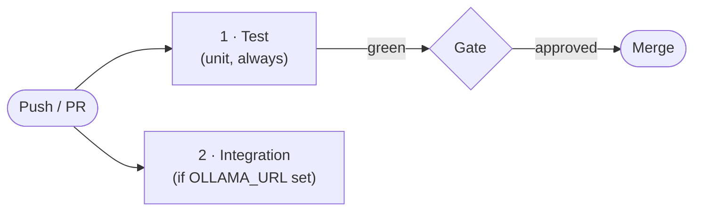

# Avatar Studio — CI/CD Plan

**Status**: Active

---

## CI Pipeline (GitHub Actions)

Trigger: every push and PR to `main`.

```
test → (optional: integration-test)
```

### Jobs

| # | Job | Condition | What it runs |
|---|-----|-----------|--------------|
| 1 | **Backend · Avatar Studio** | Always | `pytest tests/ -m "avatar and not integration"` |
| 2 | **Integration · Avatar Studio** | Only if `vars.OLLAMA_URL` set | `pytest tests/ -m "avatar and integration"` |



### Job detail

#### backend-avatar (always runs)

```yaml
steps:
  - uses: actions/checkout@v4
  - uses: actions/setup-python@v5
    with: { python-version: "3.11" }
  - run: pip install -e ".[dev]"
  - run: pytest tests/ -m "avatar and not integration" -v --tb=short
```

#### integration-avatar (conditional on OLLAMA_URL)

```yaml
if: ${{ vars.OLLAMA_URL != '' }}
steps:
  - uses: actions/checkout@v4
  - uses: actions/setup-python@v5
    with: { python-version: "3.11" }
  - run: pip install -e ".[dev]"
  - run: pytest tests/ -m "avatar and integration" -v --tb=short
    env:
      OLLAMA_URL: ${{ vars.OLLAMA_URL }}
```

To enable integration tests: **Settings → Variables → New repository variable → `OLLAMA_URL`** pointing to an accessible LLM Gateway or Ollama instance.

---

## Branch Protection

The `Main Branch Protection` ruleset (`.github/rulesets/`) requires:
- No force-push to `main`
- No direct deletion of `main`
- **Backend · Avatar Studio** CI job must pass before merge

---

## Quality Gates

- All unit tests pass
- No import errors (package installs cleanly)

---

## CD

- Tag `ver-X.Y.Z` on `main` → publish as `avatar-studio` to GitHub Packages or private registry
- Dashboard depends on it via:
  ```
  avatar-studio @ git+https://github.com/E-Brons/avatar-studio.git@ver-X.Y.Z
  ```
